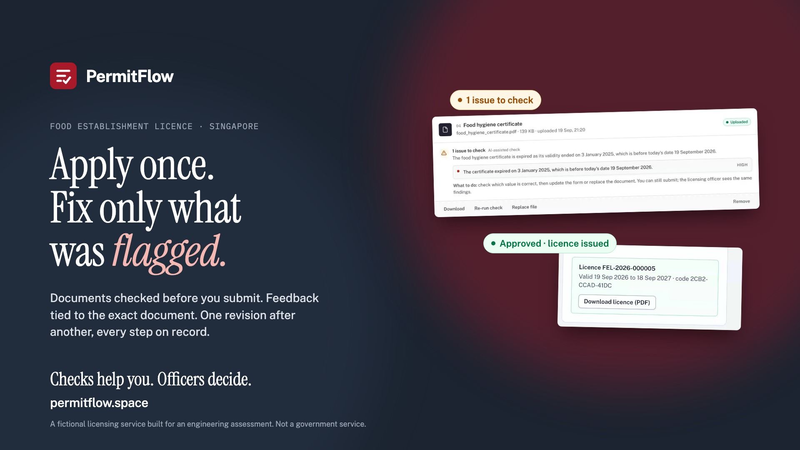
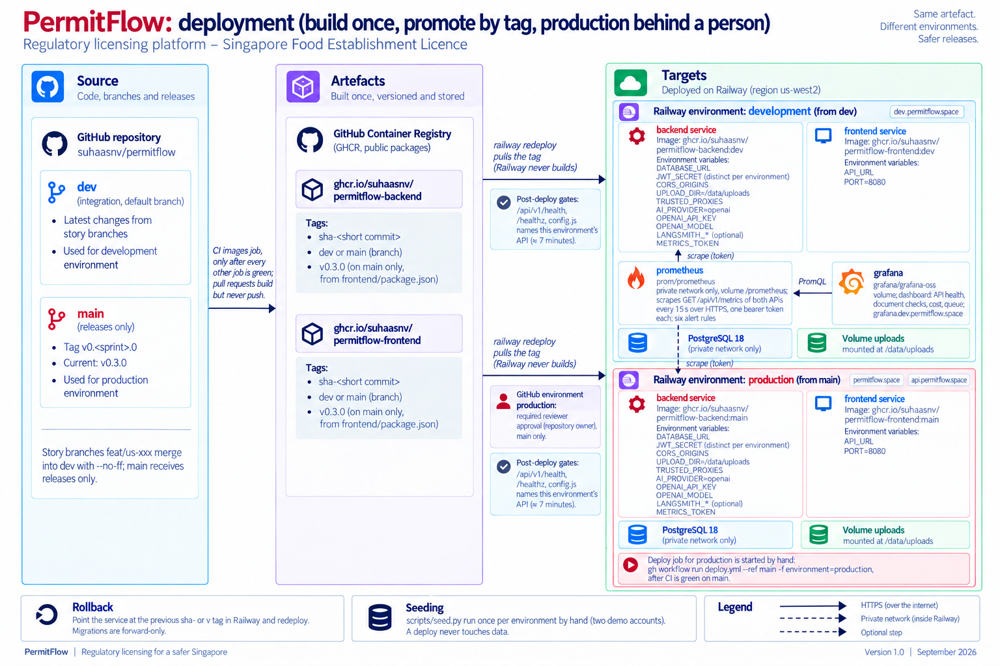
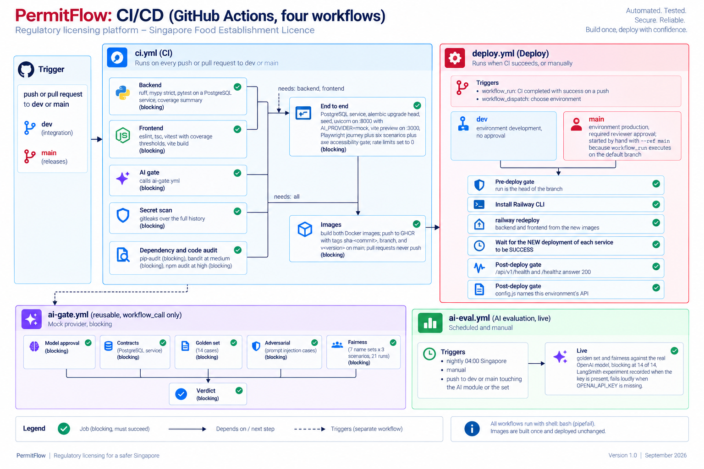

# PermitFlow

## Live: [permitflow.space](https://permitflow.space)



https://github.com/user-attachments/assets/942739f7-e2bd-4360-b525-ecf960a7e796

*Launch video, 70 seconds. The full-resolution file, the narrated walkthrough (4 min 36 s) and the technical video (4 min) are in `docs/13-debrief/video/`.*

A regulatory licensing platform built for a 3-day full-stack assessment. Business operators (the business owner, or an agent applying on the business's behalf) apply for a Food Establishment Licence, the assumed domain, through a guided form with checked uploads; licensing officers review the submission, leave feedback tied to a specific section or document, and request a resubmission in which only the flagged parts reopen; every status change, feedback round and decision is audited; approval issues a licence certificate the business can download. An advisory AI verifier reads each uploaded document and compares it with the form before anyone submits; it never decides anything.

**Try it:** production, v0.3.0: https://permitflow.space (one example application waiting in the officer's queue). Development environment: https://dev.permitflow.space (platform host as a fallback: https://frontend-development-afe2.up.railway.app). Demo accounts below. Local setup takes about ten minutes (below).

**For the debrief:** `docs/13-debrief/` holds the pitch deck, the technical deck (scope, architecture, the four decisions that carry the brief's guarantees, branching, delivery, evidence, and how AI was used, with speaker notes) and three videos: a 70 second launch video, a narrated walkthrough and a short technical video. Start with the technical deck's handout PDF if you have ten minutes.

**What is built, deferred and mocked:** `SCOPE.md`. Use cases 1 and 2 are complete (submission with real-time AI checks, unlimited resubmission rounds, officer review with contextual feedback, templates, revision compare, resolution tracking, audit trail, role-specific status labels); use case 3 (site-visit checklist) is deferred with its three statuses present in the state machine. Beyond the brief: withdrawal, draft deletion, feedback undo and reopen, a licence certificate, a landing page.

**Stack, in one paragraph** (`docs/03-architecture/decisions/ADR-009-stack-and-delivery-pipeline.md`): FastAPI + SQLAlchemy 2 + Alembic + Pydantic v2 on PostgreSQL 16 for the backend, because Pydantic validates both the HTTP boundary and the AI provider's output with one vocabulary, and PostgreSQL gives row locks, UUIDs and JSONB for immutable revision snapshots. React 19 + TypeScript strict + Vite + Tailwind + TanStack Query + React Hook Form + Zod for the frontend, because polling a verification status and validating a sectioned form inline are what those libraries are for. pytest on a real database, vitest, Playwright; GitHub Actions; Docker images to GHCR; Railway with two environments. A modular monolith (`api → services → domain / repositories → models`, `domain/` pure Python) with an explicit state-machine table, same-transaction audit rows and an AI module behind a provider interface (`docs/03-architecture/`).

Everything else you might look for: `CHANGELOG.md` (what shipped when), `docs/README.md` (index of every document), `AI_USAGE.md` (full account of how AI tools were used), `docs/11-reviews/ISSUES_AND_MITIGATIONS.md` (what went wrong and what we did about it), `docs/13-debrief/` (the pitch deck, the technical deck, the launch video and the narrated walkthrough).

Contents: Run locally · Demo accounts · Security · Tests and checks · Environment variables · Project layout · Branching and deployment · CI · AI verification · AI Usage · Release notes · What I would do next.

## Run locally

Requirements: Docker (for PostgreSQL), Python 3.12 with [uv](https://docs.astral.sh/uv/), Node 24. Git LFS only if you want the videos and the prototype PDF under `docs/` (they arrive as pointer files without it).

```bash
cp .env.example .env
# The app refuses to start with the placeholder secret; set any 16+ random characters (macOS/Linux):
sed -i.bak "s|^JWT_SECRET=.*|JWT_SECRET=$(openssl rand -hex 32)|" .env && rm .env.bak
docker compose up -d db          # PostgreSQL 16 on localhost:5432 (+ permitflow_test database)

cd backend
uv sync
uv run alembic upgrade head
uv run python scripts/seed.py           # demo accounts, see below
uv run uvicorn app.main:app --reload   # http://localhost:8000/api/v1/health, docs at /api/docs

cd ../frontend
npm install
npm run dev                            # http://localhost:3000
```

Local quotas: an operator may hold 20 open drafts and run 60 AI checks a day, and the mock provider counts too, so a day of manual testing plus a few end-to-end runs reaches them. For local work set `MAX_DRAFTS_PER_USER=0` and `AI_RUNS_PER_USER_PER_DAY=0` in `.env` (0 disables). Reading order for the code: `README.md`, `SCOPE.md`, `docs/03-architecture/ARCHITECTURE.md`, `docs/03-architecture/STATE_MACHINE.md`, `docs/07-ai/AI_ASSURANCE.md`.

## Demo accounts

`backend/scripts/seed.py` creates two accounts (idempotent). Sample documents to upload, clean and with planted issues: `docs/12-demo/documents/`. The same two accounts exist in every environment, seeded once each; the password is the value of `SEED_PASSWORD` at seed time, which is the default `PermitFlow!2026` everywhere, including production, because this is a demonstration whose credentials are meant to be shared (the privacy policy and the sign-in page say so, and say not to enter real personal data).

| Role | Email | Password | Where |
|------|-------|----------|-------|
| Operator (Tan Wei Ling) | operator@permitflow.example.sg | `PermitFlow!2026` | https://permitflow.space/login, https://dev.permitflow.space/login, http://localhost:3000/login |
| Licensing officer (Rahim bin Abdullah) | officer@permitflow.example.sg | `PermitFlow!2026` | same |

There is no admin account yet: the admin epic is deferred to v0.4.0 and `backend/scripts/seed.py` seeds only these two. There is no self-registration or password reset by design (`SCOPE.md`, DEFERRED table: "User registration, password reset, MFA, SSO", omitted because identity is not what the assessment evaluates). Each role lands in its own workspace; a URL for another role shows "Not available for your role" and the API answers 403. Sign-in attempts are limited to 20 a minute per client and 10 failed attempts a minute per client; expect a 429 for a minute if a shared demonstration session trips it.

## Security

Argon2 password hashes; JWT access tokens (8 h) with the role claim, re-checked against the user row on every request; two sign-in limits per client IP (10 failed attempts, and 20 attempts of any outcome, per minute; 429, proxy-aware); generic 401 for wrong email or password; security headers and CORS allowlist; the app refuses to start unless `JWT_SECRET` is at least 16 characters, in every environment including tests, and the `.env.example` placeholder is refused; there is no fallback secret in the code. Authorization is server-side on every route (role dependency per router, ownership as 404, sub-resource checks) and every application-scoped endpoint has an authorization test (wrong role, wrong owner, foreign ids; the readiness review lists the one notification route without its own). Uploads: allowlist (PDF, PNG, JPG, TXT), 10 MB, magic-byte check, server-generated keys, served only through authorised endpoints. Abuse resistance (US-058): every request except the health checks is rate-limited per client (240 a minute, sign-in attempts 20, 429 with `Retry-After`); an operator holds at most 20 open drafts; verification runs are counted in the database per applicant (60 a day) and per platform (1,000 a day, the cost ceiling), and a run over quota is stored `unavailable` without a model call; CSP, HSTS and Permissions-Policy on both tiers; `pip-audit`, `bandit` and `npm audit` block the build. Threats and controls: `docs/06-security/THREAT_MODEL.md` (T1 to T22). The owner's hardening checklist and the four abuse scenarios, each with what happens now and its test: `docs/06-security/SECURITY_REVIEW.md`.

**Privacy, legal and accessibility** (US-057): `/privacy`, `/terms` and `/cookies` pages written from the code (no cookies, no analytics, no third-party scripts, fonts self-hosted; transfers to OpenAI, LangSmith and Railway disclosed; demonstration-only notices on sign-in and uploads); an axe-core gate in Playwright (WCAG 2.2 AA plus best practice) over 23 screen states at desktop and phone width, run in CI; every text token recomputed against every surface for contrast. The owner's checklist, item by item with evidence and the laws considered: `docs/11-reviews/LEGAL_AND_ACCESSIBILITY_REVIEW.md`.

## Tests and checks

```bash
cd backend && uv run pytest && uv run ruff check . && uv run mypy
cd frontend && npm test && npm run lint && npm run typecheck && npm run build
cd backend && uv run pytest --cov=app        # coverage, fails under 80 %
cd frontend && npm run test:coverage         # coverage with every source file counted, thresholds in vite.config.ts
```

756 backend test cases from 167 test functions (one function, the state-machine sweep, contributes 588 parametrised cases; 106 integration cases run on a real Postgres), 158 frontend tests, eight Playwright specs (the journey, six scenarios, the accessibility gate), plus an API-level edge-case run of 166 checks (`backend/scripts/uat_edges.py`, `docs/10-uat/UAT_PLAN.md`). Coverage on 20 Sep 2026: backend 95 % statements, frontend 81.2 % statements and 84.2 % lines, both measured over every source file and enforced in CI (`docs/08-testing/TEST_STRATEGY.md`, US-053).

Backend tests run against the real `permitflow_test` database: the Alembic migrations are applied from scratch at the start of the session and every table is truncated between tests. The AI provider is forced to `mock` in tests unless `TEST_LIVE_AI=1`.

The critical journey (apply, submit, flag, fix only the flagged part, resubmit, compare, resolve, approve, download the licence) runs in a real browser with Playwright against the running stack:

```bash
# backend on :8000 with AI_PROVIDER=mock and seeded users, Vite on :3000
cd frontend && npx playwright install chromium   # once
cd frontend && npm run e2e        # journey, six scenario specs and the accessibility gate (E2E_API_URL if the backend is not on :8000)
```

Layers and what each protects: `docs/08-testing/TEST_STRATEGY.md`.

## Environment variables

See `.env.example`; every runtime variable is documented there and in `docs/09-operations/OPERATIONS.md` (`SEED_PASSWORD` is read by the seed script only). `JWT_SECRET` is required in every environment, tests included (the suite signs with a random secret per run); the frontend reads the API URL from `VITE_API_URL` in `frontend/.env` (in the container, from `API_URL` at start) and needs no `.env` locally: it defaults to `http://localhost:8000/api/v1`. Two test-only switches are not runtime variables and live with the test docs: `TEST_LIVE_AI` (`docs/09-operations/OPERATIONS.md`) and `E2E_API_URL` (`docs/08-testing/TEST_STRATEGY.md`).

## Project layout

```
backend/   FastAPI + SQLAlchemy 2 + Alembic (api → services → domain / repositories → models)
frontend/  React + TypeScript + Vite + Tailwind + TanStack Query + React Hook Form + Zod
docs/      requirements, architecture, ADRs, design system and prototype, planning, security, operations, debrief material (decks and videos, videos in Git LFS)
```

## Branching and deployment



`main` is production, `dev` is integration, work happens on `feat/*` branches: `docs/09-operations/BRANCHING.md`.

Two images (backend, frontend) are built once in CI and pushed to GHCR; Railway pulls them. Push to `dev` deploys the `development` environment automatically; a push to `main` builds the release images; production is then deployed by hand (`gh workflow run deploy.yml --ref main -f environment=production`), and that job pauses for the owner's approval in GitHub Actions before Railway is touched (the workflow does not attempt production automatically: a `workflow_run` job executes on the default branch, `dev`, which the production environment does not admit; recorded in `docs/09-operations/OPERATIONS.md`). Each environment has its own database, uploads volume and secrets, and every deployment is gated on health afterwards. Either can be redeployed by hand from the Deploy workflow. Hosts (US-052): production https://permitflow.space and https://api.permitflow.space (live since v0.3.0, 19 Sep 2026); development https://dev.permitflow.space and https://api.dev.permitflow.space (Railway fallbacks: https://frontend-development-afe2.up.railway.app, https://backend-development-4e04.up.railway.app/api/v1). Details, secrets, seeding and rollback: `docs/09-operations/OPERATIONS.md`.

## CI



`.github/workflows/ci.yml` runs on every push and pull request to `main` and `dev`, seven jobs:

| Job | What it does |
|-----|--------------|
| Backend | `uv sync`, ruff (lint and format), mypy strict, pytest with coverage against a Postgres 16 service (fails under 80 %) |
| Frontend | `npm ci`, oxlint, tsc, vitest with coverage thresholds (80 % statements and lines), vite build |
| End to end (includes the accessibility gate) | Starts Postgres, migrates and seeds, serves the backend on :8000 with the mock provider, builds the frontend and serves it with `vite preview` on :3000, then runs the Playwright journey, the six scenario specs and the accessibility gate with the per-client limits switched off for the runner; server logs and the Playwright report are attached when it fails |
| Secret scan | gitleaks over the full history |
| AI gate | Its own workflow (`ai-gate.yml`, US-056) called from CI: six stages on the mock provider (they prove the pipeline and the harness, not the model; the model is measured by `ai-eval.yml`), each a job named in the summary: model approval (pinned model, closed enums, strict schemas, prompt version), contracts, the 14-case golden set (blocking at 100 % of the counted cases), adversarial (injection cases must land on `needs_review`), fairness (6 name sets swapped into 3 scenarios, 18 runs, each must match its scenario's baseline), verdict |
| Dependency and code audit | pip-audit (blocking), bandit at medium severity (blocking), npm audit at high (blocking); the image job waits for it |
| Images | Builds the backend and frontend images; on `dev` and `main` pushes them to GHCR tagged with the branch and `sha-<commit>` |

`deploy.yml` runs after a green CI on `dev` and redeploys the development environment from the new images; production is a manual, approved run against a pinned release image (see Branching and deployment).

`ai-eval.yml` is the live pipeline (US-054): the same 14 golden and adversarial cases and the fairness check through the real model (`gpt-4.1-mini`, temperature 0), blocking at 14 of 14 and 21 of 21, with the model and prompt version stamped in the result. It runs nightly at 04:00 Singapore, by hand (with an optional lower pass rate for exploration), and on every push to `dev` or `main` that touches the AI module, the extraction, the rules or the golden set. It needs the `OPENAI_API_KEY` repository secret and refuses to run without it, so a fork's pull request never spends the key. The gate proves the pipeline on every push; this one proves the model, and keeps 90 days of results as artifacts. The one-page explanation of all of it: `docs/07-ai/AI_ASSURANCE.md`.

The E2E job waits for the backend and frontend suites, so a broken unit test never spends the browser minutes.

## AI verification

Every uploaded document is checked in the background against the application form (`backend/app/services/verification.py`): text is extracted (PDF and TXT; images are stored but reported as unreadable), sent to a provider behind the `VerificationProvider` interface, and the structured result is validated and post-processed by deterministic rules before it is stored. `AI_PROVIDER=mock` (default) uses a deterministic provider with no network; `AI_PROVIDER=openai` uses the OpenAI API with `OPENAI_API_KEY` and `OPENAI_MODEL` (default `gpt-4.1-mini`). Results are advisory: they never change an application's status, and the operator sees a plain-language outcome while the officer also sees confidence, evidence and the model used. Design and prompt contract: `docs/07-ai/AI_VERIFICATION_DESIGN.md`. With `LANGSMITH_API_KEY` set, every OpenAI check is traced to LangSmith (parent run with the verification run id, application id and prompt version; child run with tokens and latency), inputs hidden by default (`LANGSMITH_HIDE_INPUTS`), region chosen with `LANGSMITH_ENDPOINT`; the evaluation harness can record a run as a LangSmith experiment (`--langsmith`), so the pass rate has a history per prompt version (US-055).

**CI for the AI.** Two layers, read them as such: the six-stage AI gate on every push runs the whole pipeline on the deterministic mock, so it proves the plumbing (schemas, rules, quotas, harness) and not the model; the live evaluation (`ai-eval.yml`, nightly, by hand, and on pushes that touch the AI path) runs the same golden and fairness sets against OpenAI and is the check that measures the verifier. Both are in the CI table above; the one-page account of every layer, what it proves and what it does not, is `docs/07-ai/AI_ASSURANCE.md`.

## AI Usage

The brief asks how AI tools were used. Short version here; the full record with prompt examples, what was discarded and where the AI was wrong is in `AI_USAGE.md`; slides 15 and 16 of the technical deck (`docs/13-debrief/technical-deck/`) cover the same ground, including how the debrief videos were made.

**Tools and tasks.** Claude Code (Anthropic's terminal coding agent; Claude Opus 5 for most sessions, Claude Fable 5.1 for some) was the pair for the whole build: solutioning documents, design system and prototype, every story's code and tests, documentation, commit messages and the sprint rituals. It ran under two standing instruction files: a global engineering standard (no `any`, typed props and state, cleanup in every `useEffect`, no unrequested refactors, propose before changes over 20 lines, build and test before every commit, conventional commits, never push without an explicit yes) and the checked-in `CLAUDE.md` with the project rules (three personas and that operators never receive internal status codes, the layering, every status change through `domain/workflow.py`, AI never mutates state, immutable revisions and same-transaction audit, upload allowlist and magic bytes, the error envelope, the per-story checklist, the Notion board). Subagents with separate briefs ran the design critiques, three edge-case reviews, a layout audit, three bug hunts, a read-only audit of the Document checks counters, an independent review of the whole submission against the brief and a final bug hunt; Claude in Chrome ran three persona run-throughs with the demo PDFs, the DNS, Railway and LangSmith dashboard steps the CLI could not do (I signed in myself every time; secrets moved from the clipboard by shell command, never through the agent). Cursor was the editor, used to read every diff before a commit; Wispr Flow dictated the long briefs, which were edited before being sent. Notion, Railway and GitHub were driven through their MCP servers and CLIs. OpenAI `gpt-4.1-mini` is used inside the product only, behind a provider interface with a deterministic mock for tests.

**Workflow the AI worked inside.** Problem first (`docs/01-discovery/PROBLEM.md`, requirements with ids), then scope (`SCOPE.md`), then solutioning (domain model, state machine as a table, ADRs, threat model, test strategy), then a design phase with a clickable prototype, then three one-day sprints on a Notion board mirrored by `docs/05-planning/USER_STORIES.md` with a definition of done per story and a close ritual per sprint, one branch per story merged `--no-ff` into `dev`, `main` only at releases; CI/CD and two environments from Day 3; independent reviews and browser run-throughs before the release; documentation last. The standing instructions are in the checked-in `CLAUDE.md`. Full account with verbatim prompts: `AI_USAGE.md`.

**Examples of instructions.** "All status changes go through `domain/workflow.py`; write the transition table as data and a test that iterates every (state, target, actor) combination." "Operators edit only the flagged sections and documents; editability comes from open, released feedback; anything else is 403." "Feedback is a draft until the officer requests resubmission, then released and frozen; officers resolve only items the operator has seen; give withdraw and resolve a 10 second undo and audit it." "Don't create different user stories because you are just increasing the scope" (a proposed "accept AI finding" story was dropped). "Explicitly test each workflow separately" (one Playwright spec per workflow, each ending on the audit trail). "Go with the cut, GHCR is fine" (images built once in CI; SAST recorded as a next step). "Production should be approved by a person" (GitHub environment with a required reviewer). "Review the application against the brief, independently and without allowances" (last-day review that scored documentation 5/10 and produced this section).

**How output was checked.** Every story: full backend suite on a real PostgreSQL, vitest, Playwright where a UI path changed, `ruff`, `mypy --strict`, `tsc --strict`; browser checks at 390, 1024 and 1280 before a story moved to Done; two persona run-throughs on the last day that found two defects the tests had missed (both fixed with tests); every prompt change gated by the 14-case harness on the mock in CI and by hand against OpenAI (the harness rejected two of three wordings tried on the last day); every subagent finding reproduced before it was fixed, three kept as product choices; docs checked against code at each sprint close and once more at the end (API table against the routers, state table against `workflow.py`, test counts, dates against `git log`). I read every diff before committing; pushes only on my explicit yes.

**Where the AI was unhelpful or wrong.** The first live verifier run invented enum values and reported an expired certificate as valid (fixed with a pinned wire schema and today's date in the prompt). It proposed a scope-creeping story and a full red landing band; both rejected. It offered an approval-stage option that the state machine did not allow (which led to the Return to review transition). The first certificate layout overflowed and a later "sliding" signature strip collided with the footer (three iterations, each checked as a rendered PNG). A subagent's scratch file was swept into a commit by `git add -A`. Notion notes carried the wrong day; two remote CI runs failed on line length the AI had not linted locally; licence dates were first computed in UTC. The verifier flagged the demo documents' "fictional document" footer as an injection until the third prompt wording. Details: `AI_USAGE.md`.

## Release notes

Current version: **v0.3.0** (19 September 2026), the version running at https://permitflow.space. It brought the public address with two isolated environments, the licence certificate issued on approval, withdrawal and draft deletion, undo and reopen for officer feedback, search on both lists, phone-width layouts, the abuse limits, the nightly AI evaluation and the accessibility gate. Use cases 1 and 2 are complete; use case 3 is not built.

Coming next, in order: **v0.4.0** introduces the admin panel (oversight of applications by status, the health of the automatic checks, an activity feed across cases, and user management with audited role changes). **v0.5.0** delivers use case 3: the officer completes the site-visit checklist on site from a tablet with draft save, flags the items that need clarification, and the operator answers only those items, round by round, with documents.

Every release carries an entry in `RELEASE_NOTES.md`, written for the people who use the product; `CHANGELOG.md` is the engineering record behind it.

## What I would do next

Known gaps first, then the next priorities. Each has an entry in `docs/11-reviews/PRODUCTION_READINESS_REVIEW.md` with severity.

1. **Use case 3 (site-visit checklist).** The three post-site statuses (Awaiting Post-Site Clarification, Pending Post-Site Resubmission, Post-Site Clarification Resubmitted) and their transitions exist and are unit-tested; the checklist model, officer capture screen, per-item clarification and the operator's targeted response are not built (`SCOPE.md`). This is the largest functional gap and the first thing to schedule.
2. **A queue and worker for the AI checks.** Verification runs in FastAPI background tasks in the same process (ADR-004); a restart marks running checks failed and the re-run button recovers them. Production wants a broker (Redis + a worker) so checks survive deploys and scale independently.
3. **Object storage.** Uploads and licences live on a Railway volume behind `FileStorage`; production wants S3-compatible storage with signed URLs and a virus scan on upload.
4. **Frontend and edge hardening.** The JWT is kept in `sessionStorage` (accepted for a demo; an httpOnly cookie with CSRF protection is the production choice); the Content-Security-Policy shipped in US-058 still allows inline styles, which a nonce scheme would remove; the rate limiter is in-process (the same windows in Redis, or edge rate limiting, in production).
5. **Evaluation, assurance and observability for the AI.** What exists: a six-stage AI gate on every push (plumbing on the mock), a nightly and on-change live evaluation against the real model (14 golden cases and 18 name-swapped fairness runs against 3 baselines, blocking), LangSmith tracing with inputs hidden and an experiment per run (`docs/07-ai/AI_ASSURANCE.md`). Next, in order: a labelled set grown from officer overrides, captured from the traces; a red-team suite beyond the two injection cases (promptfoo, now an OpenAI open-source project, driving the real pipeline through a Python provider, or garak or PyRIT); Project Moonshot (AI Verify Foundation) runs through `moonshot-cicd`, mapped to IMDA's Starter Kit for Testing LLM-Based Applications, as the Singapore assurance evidence a regulator would ask for, with the Model AI Governance Framework for Generative AI dimensions (testing and assurance, security, incident reporting) cited in the readiness review; moving the traces to self-hosted Langfuse or a LangSmith APAC organisation so document excerpts stay in region, emitted with OpenTelemetry GenAI attributes (conventions still in development); a multilingual prompt-injection classifier (Llama Prompt Guard 2) in place of the English-only phrase heuristic; confidence calibration (reliability diagram and Brier score over the labelled set, replacing the fixed 0.6 threshold); bias evaluation beyond name invariance: a Project Moonshot bias benchmark and per-issue-code accuracy split by document language; image OCR for scanned uploads; a CJK-capable font for the certificate.
6. **Admin epic (US-070 to US-073).** Oversight dashboard, AI health panel, cross-application audit feed, user management; the role and routes are reserved, the screens are not built.
7. **Delivery and rollback.** Code rollback is the previous release's pinned image plus the approved deploy job; schema rollback rests on the migration compatibility rule; data rollback is Railway's managed backup only. Next: a nightly `pg_dump` and uploads copy with a restore drill, a staging copy of production data for migration rehearsal, blue/green or at least two replicas, Semgrep (PR-blocking) and CodeQL on `main`, Trivy on the GHCR images with an SBOM, backup and retention policy for the database and files.
8. **Product.** Email delivery for notifications (mocked today), officer assignment and workload routing, more licence types via a configurable form schema, a public licence verification page keyed by the certificate's verification code, digital signing of the certificate.
