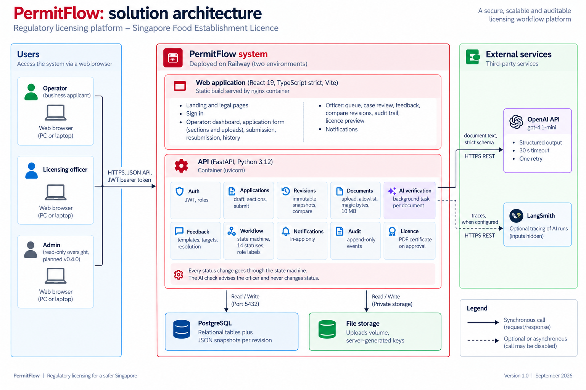

# PermitFlow: Architecture

A modular monolith (ADR-001): one FastAPI backend, one React frontend, one PostgreSQL database, local file storage, and an isolated AI verification module.

## System diagram



## Backend layering and dependency direction

```
api  ──▶  services  ──▶  domain
 │            │            ▲
 │            ▼            │ (domain imports nothing from below)
 │        repositories ──▶ models
 │            │
 └──────▶  infra (settings, db, storage, ai, notifier, logging)
```

Rules:
- `api` never imports `repositories` and never queries or mutates `models`; it may name two model types (`User`, `Application`) in annotations. It calls services and maps exceptions to HTTP. Operator-facing refusals are worded by `domain/operator_errors.py` with the operator's own label and no internal code (FR-026).
- `domain` is pure Python: no SQLAlchemy, no FastAPI, no I/O. It contains the enumerations (`domain/enums.py`, re-exported by `models/enums.py` for the persistence layer), the state machine (`domain/workflow.py`: transition table, guards, `available_actions` for the UI), labels (`domain/labels.py`: the assessment table verbatim plus the badge tone), form schema, diff and resolution rules: the code a reviewer should read first.
- `schemas` (`app/schemas/`): Pydantic request and response models shared by the API and the services. No ORM, no I/O; they may import `domain` enums. Services return these so routers stay thin, and the layering test forbids services, schemas and repositories from importing `app.api` or FastAPI.
- `services` orchestrate: load via repositories, apply domain rules, mutate, write audit events, create notifications, commit. One service method = one transaction. The only SQLAlchemy name a service imports is `Session`; every statement (`select`, `update`, `delete`, `text`) lives in a repository.
- `infra.ai` exposes `VerificationProvider`; `services.verification` is the only caller. No other module imports `infra.ai`.
- `tests/unit/test_layering.py` enforces these rules by parsing every module: routers do not import repositories or query models; domain does not import SQLAlchemy or FastAPI; schemas are free of ORM and I/O; services import nothing from SQLAlchemy but `Session`; only the verification service reaches the AI providers; only `AuditRepository.purge_draft` deletes audit rows.

## Module boundaries and data ownership

| Module | Owns tables | Public service API (examples) |
|--------|-------------|-------------------------------|
| auth | users | `authenticate(email, password) -> Token`, `current_user()` |
| applications | applications | `create`, `get_for(user, id)`, `list_for(user)`, `update_draft(user, id, section, data)`, `transition(officer, id, target, note, expected_version)` |
| revisions | application_revisions | `submit(operator, id)`, `resubmit(operator, id)`, `list(id)`, `compare(id, from_no, to_no)` |
| licence | licences, audit_events | `issue(app, officer)` from the approval transaction; `preview`; `open_for_download` (US-051) |
| withdrawal | applications, audit_events, notifications | `withdraw(operator, id, reason)` (US-038) |
| documents | documents | `upload(user, id, type, file)`, `replace`, `download`, `list` |
| verification | verification_runs | `enqueue(document_id)`, `run_verification(document_id)`, `latest(document_id)`, `rerun` |
| feedback | feedback | `create(officer, id, target, message, template_key)`, `resolve`, `withdraw`, `list`, `templates()` |
| notifications | notifications | `notify(user_ids, kind, application, ...)`, `list(user)`, `mark_read` |
| audit | audit_events | `record(application_id, actor, event_type, payload)`, `list(application_id)`, `purge_draft(application_id)` |
| metrics (US-077) | none (reads `applications` through its repository for the by-status gauge) | `refresh_gauges(db)`; the counters live in `core/metrics.py` and are incremented by the services where the events happen (verification finished, quota refused, transition committed) and by the outermost middleware (every request, every 429); `infra/ai/openai_provider.py` counts the tokens the API reports; `docs/13-observability/OBSERVABILITY.md` |
| admin (built 21 Sep 2026, US-070 to US-073) | none: reads other modules' tables through their repositories (`AuditRepository.feed`, `idle_applications`; `ApplicationRepository.count_by_status`; `DocumentRepository.runs_since`), writes users through `UserRepository` | `AdminOverviewService.overview()`, `AdminFeedService.feed()`, `AdminUserService.directory()`, `change(role, is_active)`, `create()`; the officer read services serve the admin's case view with the viewer's actor (ADR-014) |

Cross-module writes go through services, never across repositories.

## Request flow examples

### Upload with AI verification
```
POST /applications/{id}/documents (multipart)
  api: auth → ownership → editability (draft: any type; pending resubmission: flagged types only)
       → validate extension/MIME/size (streamed, 10 MB cap) → magic bytes
  DocumentService.upload (one transaction): Document row (is_current, supersedes) →
     VerificationRun(pending) → audit document.uploaded → commit
     file bytes are written to FileStorage before commit; on commit failure the file is deleted
  BackgroundTasks.add(run_verification, run_id)   # request session is already closed at this point
  201 { document, verification: { status: "pending" } }

run_verification(run_id):   # plain sync function; FastAPI runs it in the threadpool
  opens its own SessionLocal() and transaction (the request-scoped session is gone)
  set running
  → extract text here, not in the request: pypdf with caps (≤ 30 pages, ≤ 20 000 chars, 10 s budget);
    images and unsupported types → unreadable (no model call); empty text → unreadable
  → injection heuristic (instruction-like phrases) → forces needs_review later
  → provider.verify(request) with 30 s timeout, one retry on transient errors (sync openai client)
  → parse wire model → validate into domain VerificationResult (extra=forbid, bounded confidence)
  → deterministic rules (confidence threshold, injection flag) → persist terminal status
  → audit verification.completed → commit
  → on any exception: failed/unavailable with reason (never raises out of the task)
  Multi-worker note: startup stale-run cleanup only marks runs whose started_at is older than the
  timeout + grace, so a peer worker's in-flight run is not killed.

Client: GET /applications/{id} polls every 2 s while any document is pending/running.
```

### Withdrawal (US-038)
```
POST /applications/{id}/withdraw  { reason? }
  api: auth → operator role → ownership
  WithdrawalService.withdraw:
    SELECT application FOR UPDATE
    domain.workflow.transition(status, withdrawn, OPERATOR) → 409 for draft, decided or already withdrawn
    status = withdrawn; withdrawal_reason; version += 1
    audit status.changed (actor = operator, trigger = operator)
    notify every active officer (title "<ref>: Withdrawn", body carries the reason)
  commit → 200 operator view (can_withdraw = false, withdrawal_reason)
```

### Resubmission
```
POST /applications/{id}/resubmit
  api: auth → ownership
  SubmissionService.resubmit:
    SELECT application FOR UPDATE; load current revision + open feedback (transaction)
    domain.diff(previous.form_data, app.draft_data) → changed sections; documents compared by sha256
    domain.resolution.validate_only_flagged_changed(changed, open_feedback) → 403 if violated
    require at least one flagged target changed → 422 otherwise
    workflow.transition(app, pre_site_resubmitted, actor=operator, ctx)
    Revision N+1 (snapshot) → feedback with changed targets → addressed
    audit revision.submitted, feedback.addressed*, status.changed
    notify officers
    commit
  200 { application (operator view) }
```

## API surface (v1)

All under `/api/v1`. Error body: `{ "error": { "code": string, "message": string, "details"?: object } }`. Every route can answer `429 rate_limited` with a `Retry-After` header (per-client sliding-minute limits, US-058; `/health` exempt); every answer carries the security headers listed in `docs/06-security/SECURITY_REVIEW.md` item 7.

| Method | Path | Role | Purpose |
|--------|------|------|---------|
| POST | /auth/login | any | JWT carrying the session id (`sid`); `409 session_active` (details: `device`, `last_seen_at`) while another device holds the account, unless `take_over: true` (US-093) |
| GET | /auth/me | any | current user |
| POST | /auth/logout | any | ends this sign-in on the server; the token answers `401 session_revoked` from then on (US-093) |
| GET | /form-schema | any | sections/fields definition |
| GET | /officer/feedback-templates | officer | comment templates from `domain/feedback_templates.py` (key, title, suggested target, message); the officer edits before sending (built, US-024) |
| GET | /applications | operator | own applications |
| POST | /applications | operator | create draft; `409 conflict` with `details.code = draft_limit` once the operator holds `MAX_DRAFTS_PER_USER` open drafts (US-058) |
| GET | /applications/{id} | operator (own) | operator view: sections, documents + verification, released feedback (all rounds, no author), `resubmit` readiness (changed and untouched flagged targets), editability from open released feedback, `needs_operator_action` (built) |
| PATCH | /applications/{id}/sections/{key} | operator (own) | update a section of the working copy (checked against editability) |
| POST | /applications/{id}/submit | operator (own) | draft → application_received |
| POST | /applications/{id}/resubmit | operator (own) | pending_pre_site_resubmission → pre_site_resubmitted |
| POST | /officer/applications/{id}/feedback/{fid}/reopen | officer | addressed → open with the same text, draft until the next round; audited `feedback.reopened` (built, US-049) |
| POST | /officer/applications/{id}/feedback/{fid}/restore | officer | undo the caller's own withdraw or resolve within 15 s; audited `feedback.restored` (built, US-039) |
| DELETE | /applications/{id} | operator (own) | delete a draft outright with files, runs and audit events; 409 once submitted (built, US-045) |
| GET | /applications/{id}/licence | owner, officer or admin | the issued certificate as PDF; 404 before approval (built, US-051) |
| GET | /officer/applications/{id}/licence/preview | officer | watermarked certificate while pending approval; nothing stored (built, US-051) |
| POST | /applications/{id}/withdraw | operator (own) | any post-submission non-terminal → withdrawn, optional reason, officers notified (built, US-038) |
| POST | /applications/{id}/documents | operator (own) | upload / replace by type; JPG and PNG are stored without metadata (US-085); 422 `storage_budget` past the application's 150 MB |
| DELETE | /applications/{id}/documents/{doc_id} | operator (own) | remove a document while in `draft` only |
| GET | /applications/{id}/documents/{doc_id}/download | owner or officer (admin included since US-072) | file; the document must belong to `{id}` |
| POST | /applications/{id}/documents/{doc_id}/verify | owner or officer | re-run verification (only when the latest run is terminal); 202 |
| GET | /applications/{id}/compare?from=n&to=m | owner or officer (admin with US-072) | field-level form diff and document add/remove/replace from `domain/diff.py`; 404 for unknown revisions (built, US-027) |
| GET | /officer/applications | officer, admin | queue: every non-draft application with applicant, internal status + officer label, server-derived next action and whose turn it is, revision count, open feedback count, document-check attention and checking counts, first submission and last activity; plus turn counts (built, US-020) |
| GET | /officer/applications/{id} | officer, admin | case view (`phase` and `outcome` for the screens to branch on and `can_resolve` per feedback item, US-083; `site_visit`: the appointment; `checklist`: the current visit's draft summary, US-060; `clarification`: every thread with the finding on top, US-066 with the operator's counter, rounds, `rounds_left`, `can_confirm_without_reply`, US-084): current revision's sections, current documents with full verification detail (confidence, evidence, model), revision history, available transitions with guard reasons, `version` (built, US-021; feedback and audit lists join with US-023 and US-029) |
| POST | /officer/applications/{id}/transition | officer | `{ target, note?, expected_version }` (Request another round, `→ pending_post_site_resubmission`, releases every drafted question with `clarification.released` per item and tells the operator with the count, US-066): row lock, version check (409 `version_conflict`), `domain/workflow.transition` (409 `invalid_transition` with `allowed`), `status.changed` audit with actor, operator notification in the same transaction (built, US-021; on `→ pending_pre_site_resubmission` every open item gets `released_to_operator_at` and `feedback.released` is audited, built with US-023) |
| POST | /officer/applications/{id}/feedback | officer | create feedback tied to a section key or document type, optional template key; 422 per-field errors; 409 unless `under_review`; audit `feedback.created`; returns the officer view (built, US-023) |
| POST | /officer/applications/{id}/feedback/{fid}/resolve | officer | open or addressed → resolved while the case is with the officer; audit `feedback.resolved`; `{fid}` must belong to `{id}` (built, US-028) |
| POST | /officer/applications/{id}/feedback/{fid}/withdraw | officer | open → withdrawn; 409 unless `under_review` and open; `{fid}` must belong to `{id}`; audit `feedback.withdrawn` (built, US-023) |
| POST | /officer/applications/{id}/documents/{doc_id}/verify | officer | re-run the AI check; same rules and audit as the operator re-run; returns the officer view (built, US-022) |
| GET | /officer/applications/{id}/audit | officer, admin | append-only audit trail with actor name and role, plain-language summary (`domain/audit_labels.py`) and payload, chronological (built, US-029) |
| POST | /officer/applications/{id}/site-visit | officer | `{ date, slot, note?, expected_version }`: the officer's first proposal for the current visit; from `under_review` the case moves to `site_visit_scheduled` in the same transaction (version check, 409 `version_conflict`); 422 per-field date and slot rules (Mon to Fri, at least one working day ahead, within 60 days); 409 when a visit is already open; audit `site_visit.proposed`; operator notified; returns the officer view (built, US-084) |
| POST | /officer/applications/{id}/site-visit/decide | officer | `{ action: accept_operator \| keep_original \| propose, date?, slot?, note? }` on a counter-proposal: confirms the operator's date, keeps the date on the table, or proposes a third one (round cap: six proposals per visit, 409 "No more dates can be proposed for this visit." beyond it); audit `site_visit.confirmed` (`how`) or `site_visit.proposed`; operator notified (built, US-084) |
| POST | /officer/applications/{id}/site-visit/confirm | officer | confirm a proposal the operator left unanswered; 409 before the reply deadline (three working days after the proposal, never after the visit date); audit `site_visit.confirmed` (`how = confirmed_without_reply`) (built, US-084) |
| POST | /officer/applications/{id}/site-visit/reschedule | officer | `{ date, slot, reason }` (reason required) on a confirmed visit before its date: becomes a new proposal the operator answers; audit `site_visit.rescheduled`; operator notified (built, US-084) |
| POST | /applications/{id}/site-visit/accept | operator (own) | accept the proposed date; the visit is confirmed; audit `site_visit.confirmed` (`how = accepted_by_operator`); officers notified (built, US-084) |
| POST | /applications/{id}/site-visit/counter | operator (own) | `{ date, slot, reason }` (reason required; Mon to Fri, at least two working days ahead, within 60 days; round cap applies): the officer decides next; audit `site_visit.counter_proposed`; officers notified (built, US-084) |
| POST | /applications/{id}/site-visit/reschedule | operator (own) | `{ date, slot, reason }` on a confirmed visit before its date: becomes a counter-proposal the officer decides; the confirmed date stays until then; audit `site_visit.rescheduled`; officers notified (built, US-084) |
| GET | /applications/{id}/clarifications | operator (own) | `ClarificationOperatorView`: only the flagged items with a released, non-withdrawn question, each with title, guidance, the requests, the operator's own responses (US-065) and a status in operator words (Waiting for your response, Sent, Clarified, No longer needed); no field exists for a result, an unflagged item or an unreleased question; the application view carries `clarification { can_respond, open_count, answered_count, round }` (built, US-064) |
| POST | /applications/{id}/clarifications/{item_id}/responses | operator (own) | `{ message }` (1 to 2000 characters): draft or rewrite the answer to the current open question on one item; 409 unless the office is waiting for answers, the item is open, and the answer is not yet sent; audit `clarification.response_drafted` once per item (built, US-065) |
| POST | /applications/{id}/clarifications/responses/{rid}/attachments | operator (own) | multipart `file`: the document rules (allowlist, magic bytes, 10 MB), three per answer (422 `attachment_cap`), 422 `storage_budget` past the application's 150 MB, images stored without metadata (US-085), an identical file is kept once and reported `unchanged`; 409 once sent; audit `clarification.attachment_added` (built, US-065) |
| DELETE | /applications/{id}/clarifications/responses/{rid}/attachments/{aid} | operator (own) | remove until sent (409 after); audit `clarification.attachment_removed` (built, US-065) |
| POST | /applications/{id}/clarifications/send | operator (own) | every open item must carry an answer (422 `details.items` with the unanswered keys); items withdrawn before the send are left out; responses get `sent_at`, items become `answered`, audit `clarification.answered` per item then `status.changed` (operator actor) to `post_site_clarification_resubmitted`; every active officer notified (built, US-065) |
| GET | /applications/{id}/clarifications/attachments/{aid}/download | owner, officer, admin | the file with `content_disposition()`; the chain attachment, response, request, item, checklist, application is checked at every hop; an id from elsewhere is 404 (built, US-065) |
| POST | /officer/applications/{id}/clarifications/{item_id}/resolve | officer | Mark clarified: an answered item becomes resolved, in `post_site_clarification_resubmitted` only; audit `clarification.resolved`; returns the case (built, US-066) |
| POST | /officer/applications/{id}/clarifications/{item_id}/reopen | officer | `{ message }`: Still needs clarification: an unreleased request with the item's next round number, the item open again; audit `clarification.reopened`; the operator sees it only after Request another round (built, US-066) |
| POST | /officer/applications/{id}/clarifications/{item_id}/withdraw | officer | an open question is withdrawn (also in the two operator-turn states); audit `clarification.withdrawn`; a send racing it has one outcome under the row lock (built, US-066) |
| GET | /checklist-schema | officer, admin | the checklist template, versioned (`domain/checklist_schema.py`: seventeen items in five sections, grounded in SFA's public Food Shop self-checklist and saying so) (built, US-060) |
| POST | /officer/applications/{id}/checklist | officer | create the current visit's draft with every item `not_assessed` (201) or return the one that exists (200), under the application row lock; 409 outside `site_visit_scheduled` and `site_visit_done`; audit `checklist.created` (visit_no) (built, US-060) |
| GET | /officer/applications/{id}/checklist | officer, admin | the current visit's checklist with counts and the sentence that still blocks a submit; 404 until created; `?visit=n` for an earlier visit (built, US-060) |
| PUT | /officer/applications/{id}/checklist | officer | draft save: the whole item list checked against the template (422 per item key), `version` (409 `version_conflict` with the current content in `details.current`) and a client `save_id` (a replayed one answers 200 with the current state); 409 once submitted; no audit row per save (built, US-060; the client autosave, retry and offline banner are US-061) |
| POST | /officer/applications/{id}/checklist/submit | officer | every item assessed and every unsatisfactory or flagged item commented (422 `details.fields` per key and `details.items`); from `site_visit_scheduled` the officer hop to `site_visit_done` is recorded first, then the system hop to `awaiting_post_site_clarification`; findings frozen; round-1 `ClarificationRequest` rows released for the flagged items; audit `checklist.submitted` (counts, flagged keys) between the two `status.changed`; one operator notification with the count; 409 on a second submit or outside the site-visit states (built, US-062, US-063) |
| GET | /admin/overview | admin | counts per internal status with the officer label, tone and whose turn (drafts as one row, not visible to officers); totals; the ten longest-idle open applications (no audit activity for more than 7 Singapore calendar days); today's submissions, resubmissions, checklists submitted and clarification rounds sent on the Singapore day; document-check health over 24 h (by outcome, average and p95 latency, provider and model, "none (mock)" without a key); runs today against `AI_RUNS_PER_DAY` (built, US-070, absorbs US-071) |
| GET | /admin/audit-feed?limit=50&before=<cursor> | admin | the newest audit events across every application and every user change, with the sentence, actor, case reference; keyset cursor `<micros>,<id>` (never `OFFSET`), `next_cursor` null at the end; 400 `bad_cursor` (built, US-072) |
| GET | /admin/applications/{id} | admin | the officer view with `actions[]` empty (the viewer's actor; ADR-014); the officer GETs for the queue, the case, the audit trail and the checklist admit the admin as well; compare and the two downloads admit any reader; `feedback-templates`, `licence/preview` and every mutation stay 403 (built, US-072) |
| GET | /admin/users | admin | the directory (name, email, role, active, protected, created) plus `self_id` (built, US-073) |
| POST | /admin/users | admin | create an account (email, name, role, password of 12+ characters); 409 `email_taken`; audit `user.created` (built, US-073, added at the owner's request) |
| PATCH | /admin/users/{id} | admin | change `role` and/or `is_active` under `FOR UPDATE` on the admin rows; 409 `self_change` (wins), `protected_account`, `last_admin`, `try_again` (a deadlock); audit `user.role_changed` (from, to), `user.deactivated`, `user.reactivated` with `application_id = null`; a deactivated user and a changed role take effect on the next request (built, US-073) |
| GET | /notifications | any | own notifications (newest first, 50) plus `unread_count` (built, US-025) |
| POST | /notifications/{id}/read | any | mark read; another user's id is 404 (built, US-025) |
| POST | /notifications/read-all | any | mark every own notification read (built, US-025) |
| GET | /metrics | bearer token (`METRICS_TOKEN`); 404 when no token is configured; exempt from the rate limit | Prometheus text format: `permitflow_http_requests_total`, `permitflow_http_request_seconds`, `permitflow_rate_limited_total`, `permitflow_verification_runs_total`, `permitflow_verification_run_seconds`, `permitflow_quota_refusals_total`, `permitflow_transitions_total`, `permitflow_applications` (gauge), `permitflow_openai_tokens_total`; route templates and enum values as labels, never ids or text (US-077) |
| GET | /health | public | `{status, database}`; 503 when the database ping fails, with the standard `error` object beside the status fields; provider details are not exposed publicly (the planned admin AI-health endpoint, US-071, would report them) |

All paths are under `/api/v1` including `/health`. FastAPI's default `{"detail": …}` bodies for 401/403/422 are replaced by explicit exception handlers so every error uses the standard shape (REL-001).

## Frontend structure

```
frontend/src
  api/            hand-written types mirroring app/schemas + thin fetch client (auth header, error mapping)
  app/            router, providers (QueryClient, Auth), AppShell
  features/       auth, landing, legal, operator, officer, admin (placeholder only, v0.4.0), shared
  lib/            zodFromSchema, format, search, session, unsaved, cn
  styles/         index.css (tokens, Tailwind theme), fonts.css
```

The tree file by file, the data flow, polling, forms, errors and the known gaps: `docs/04-design/FRONTEND_ARCHITECTURE.md` (rewritten from the tree on 20 Sep 2026).

State: server state in TanStack Query (query keys per resource; invalidation after mutations; polling while verifying). Auth in a small context. Forms via React Hook Form with Zod resolvers built from `/form-schema`.

## Error boundaries

- API: a global exception handler maps domain exceptions (`NotFound`, `Forbidden`, `InvalidTransition`, `ValidationFailed`, `VersionConflict`) to the standard error body; unexpected exceptions → 500 with a request id and no stack trace.
- Verification task: catches everything, records failure, never propagates.
- Frontend: a query that fails on first load is rendered by `ErrorPanel` with the request id and Retry, while a failed background refetch keeps the cached view (and any unsaved form input) until the next poll succeeds; mutation errors shown inline as an `Alert` and preserve input; 429 shows the server message and queries never retry a 4xx; an unknown route renders `NotFoundPanel`. There is no React error boundary for render crashes (recorded as a gap in the US-058 review).

## Authorization boundaries

- Authentication: `get_current_user` dependency (JWT → User row; rejects unknown users and `is_active = false`).
- Role: `require_role(...)` on the officer router and on the routes an owner shares with an officer (compare, download, licence, re-run); `AdminUser` guards the admin router; `OfficerOrAdmin` admits the administrator to the officer's reads (queue, case, audit trail, checklist) and `AnyReader` to the shared reads (compare, the two downloads), while every officer mutation keeps `OfficerUser`; an admin gets 403 from every write route and from the operator's routes (US-072, ADR-014).
- Ownership: `ApplicationRepository.get_for(user, id)` applies `operator_id` filter for operators; raises `NotFound`.
- Editability: `domain.editability.editable_targets(status, open_feedback)` used by section update and document upload.
- Transition role and guards: `domain.workflow`.
- Response shaping: `ApplicationOperatorView` vs `ApplicationOfficerView`.

## Observability

- Request logging middleware: request id, method, path, status, duration, user id; request id echoed in `X-Request-ID`.
- Verification logs: run id, provider, model, latency, outcome, `raw_output_valid`.
- `/health`: database ping (503 on failure). AI provider configuration is never reported publicly; the planned admin AI-health endpoint (US-071) would carry it.
- Metrics (US-077): `core/metrics.py` holds the Prometheus counters and histograms, the outermost middleware counts every answer, the services increment their own events, `api/v1/metrics.py` renders them behind a bearer token. Prometheus scrapes them every 15 s; Grafana draws one dashboard (API health, document checks, cost, queue); seven alert rules and an hourly digest reach Telegram, where a small bot also answers `/status` and friends. The layer in full, with the Railway services: `../13-observability/OBSERVABILITY.md`.

## Deployment

- Local: `docker compose up db` (PostgreSQL only; the API and the frontend run natively with `uvicorn` and `vite`) or `docker compose --profile full up` to also run the API container. A local database is kept because the test suite truncates tables between tests and because a reviewer must be able to run the system from a clean clone without any hosted credentials (NFR-001).
- Railway, two environments (`development` from `dev`, `production` from `main`), each with its own Postgres, uploads volume, secrets and domains; both tiers run as GHCR images built once in CI (frontend: nginx with the API URL injected at start), deployed by `deploy.yml` behind health gates and, for production, a reviewer approval. Shape, secrets, seeding and rollback: `docs/09-operations/OPERATIONS.md`.
