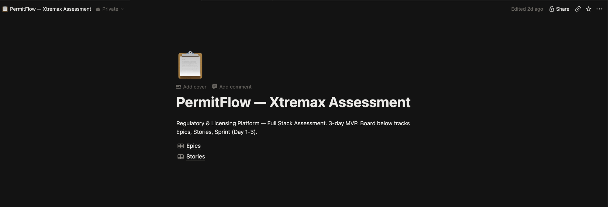
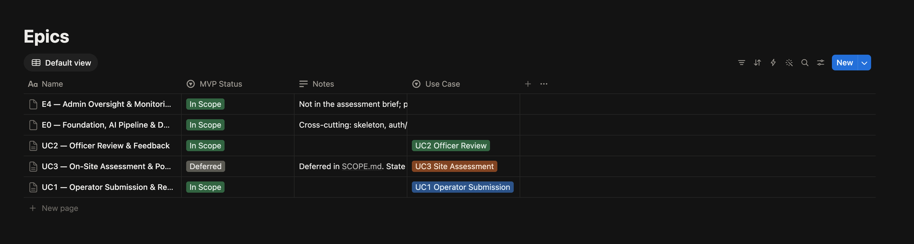
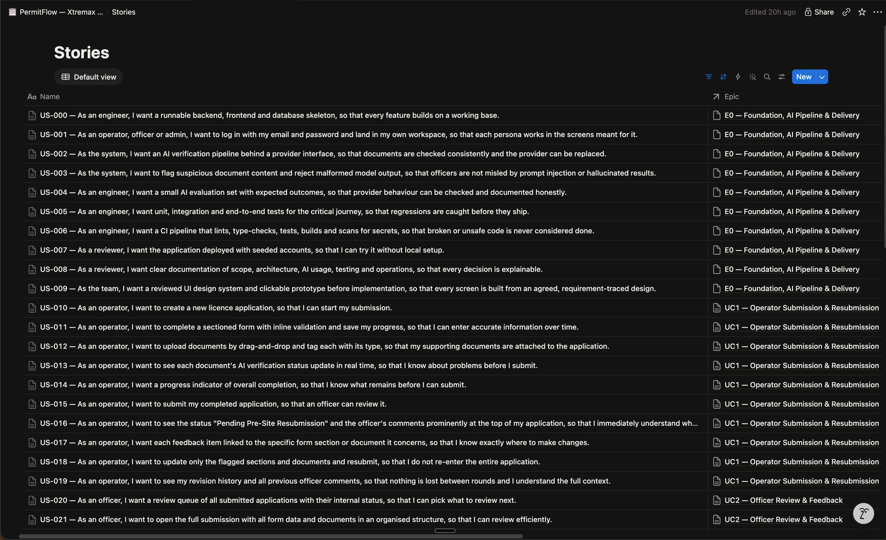

# PermitFlow: Sprint Plan

Three calendar days, one engineer with AI assistance. We ran **three one-day sprints** for the assessment (v0.1.0 to v0.3.0); v0.4.0 runs five more of the same length after the submission (Sprints 4 to 8, below, planned on 20 Sep 2026 in `RELEASE_PLAN_V0_4_0.md`). A one-day sprint is the shortest cycle that still has a real goal, a review and a close; anything shorter turns into task-switching. The Notion `Sprint Day` field is the sprint (Day 1 = Sprint 1, and so on). Stories move `Not started → In progress → Done` on the Notion board as they are picked up and finished; a sprint is closed only when the close ritual below has run.

The board as it stands after the v0.3.0 release (19 September 2026):







## Cadence

| Event | When | Duration | Output |
|-------|------|----------|--------|
| Sprint planning | Start of each day | 15 min | Sprint goal confirmed; stories pulled into Ready in dependency order; WIP limits respected (In Progress ≤ 2) |
| Mid-sprint check | Midday | 5 min | Anything at risk is cut or simplified now, not at 23:00; `SCOPE.md` updated if scope changes |
| Sprint review | End of day | 20 min | Demo the sprint goal end to end locally (Sprint 1–2) or on the deployed URL (Sprint 3); run the UAT scenarios that apply |
| Sprint close | Immediately after review | 10 min | Close ritual (below) executed; `CHANGELOG.md` entry written; Notion statuses final |
| Retro | Part of close | 5 min | One line each: what slowed us, what to change tomorrow: recorded in `CHANGELOG.md` |

## Definition of Done

Story level: `DEFINITION_OF_DONE.md` (acceptance criteria met, validation, authorization, tests, UI states, docs, Notion updated).

Sprint level: a sprint is Done when:
1. The sprint goal is demonstrable end to end.
2. Every story marked Done meets the story DoD; stories not meeting it are moved back to In progress or to the next sprint, never marked Done "mostly".
3. The full test suite is green locally and CI is green on the last commit.
4. The core journey (submit → review → feedback → resubmit → compare) still works: regression here blocks the close.
5. `CHANGELOG.md` has a dated entry listing what shipped, what slipped and why.
6. Notion board reflects reality: Done stories Done, slipped stories re-assigned to the next sprint with a note.

## Sprint close ritual (run every time)

```
1. pytest + vitest (+ playwright when it exists): all green
2. git log since sprint start: every commit has a conventional message
3. Notion: set Status = Done for finished stories; move unfinished to next Sprint Day with a Notes line "slipped from Sprint N: <reason>"
4. CHANGELOG.md: "## Sprint N: <date>" with Shipped / Slipped / Retro
5. Re-read SCOPE.md: still true? Update MUST/SHOULD/DEFERRED if anything changed
6. Commit: "docs: close sprint N"
```

## Design phase: 17 September 2026 (before Sprint 1)

US-009: design direction, design system, clickable prototype (23 artboards), design docs in `docs/04-design/`, two critique passes. No code. Sprint dates below shifted by one day as a result.

## Sprint 1, 18 September 2026: "An operator can submit" (closed)

Closed 18 Sep 2026: goal met; US-002 OpenAI half moved to Sprint 2; retro in `CHANGELOG.md`.

**Goal:** an operator logs in, creates an application, fills the form, uploads documents that are verified by the mock provider, and submits; the state machine, role labels and authorization exist and are unit-tested; CI skeleton runs.

| Story | Title (short) | Priority |
|-------|---------------|----------|
| US-000 | Project skeleton, DB, migrations, health, CI skeleton | MVP |
| US-001 | Login per persona (operator, officer, admin) | MVP |
| US-030 | Role-specific status labels | MVP |
| US-010 | Create application | MVP |
| US-011 | Sectioned form with validation | MVP |
| US-012 | Drag-and-drop document upload | MVP |
| US-002 | AI verification pipeline (mock provider) | MVP |
| US-014 | Progress indicator | MVP |
| US-015 | Submit application | MVP |
| US-006 | CI pipeline (skeleton) | MVP |

**Exit criteria:** Sprint DoD + state machine tests cover every (state, target, role); operator-B-cannot-see-A test passes; `docker compose up` + README steps work on a clean clone.

**Cut order if behind:** progress indicator UI polish → CI skeleton (keep local checks) → nothing else; the rest is the foundation.

## Sprint 2, 18 September 2026 (afternoon): "The loop closes, twice" (closed)

Closed 19 Sep 2026: goal met; nothing slipped; US-033 and US-034 added and Done; retro in `CHANGELOG.md`.

**Goal:** the officer reviews, gives contextual feedback and requests resubmission; the operator sees feedback on top, edits only flagged targets and resubmits; the officer sees highlights, compares revisions, tracks resolution and advances to an outcome; the audit trail and notifications work; OpenAI provider is wired. Two full rounds work end to end.

| Story | Title (short) | Priority |
|-------|---------------|----------|
| US-020 | Review queue | MVP |
| US-021 | Full submission view + Start review | MVP |
| US-022 | AI results beside documents | MVP |
| US-023 | Contextual feedback | MVP |
| US-024 | Comment templates | MVP |
| US-025 | Status transitions + operator notification | MVP |
| US-016 | Resubmission view: status + feedback on top | MVP |
| US-017 | Feedback anchored to section/document | MVP |
| US-018 | Edit only flagged, resubmit | MVP |
| US-019 | Operator history | MVP |
| US-026 | Officer notified on resubmission | MVP |
| US-027 | Highlights + revision compare | MVP |
| US-028 | Feedback resolution tracking | MVP |
| US-029 | Audit trail | MVP |
| US-031 | Site visit and outcome transitions | MVP |
| US-032 | Operator sees only final outcome | MVP |
| US-013 | Live verification status polish | MVP |
| US-002 | OpenAI provider | MVP |
| US-003 | Injection heuristic + malformed output handling | MVP |
| US-033 | Operator edge cases from the review pass (session, unsaved input, submit races, locked chrome) | MVP (added 19 Sep) |
| US-034 | Backend edge cases from the review pass (limiter, upload cap, stale runs, audit, downloads) | MVP (added 19 Sep) |

**Exit criteria:** Sprint DoD + integration test for the whole loop (two rounds) + operator visibility test + audit sequence test.

**Cut order if behind:** follow `DELIVERY_PLAN.md` §Cut order: any-two-revision compare → static Zod schemas → queue filter / re-run / draft delete → notification bell → templates UI (endpoint stays). MUST stories (US-024 templates, US-031 outcome transitions) are never cut; their UI becomes plainer. The OpenAI provider may slip to Sprint 3 morning (mock stays default) without cutting anything.

## Sprint 3, 18 to 19 September 2026: "Ship it honestly" (closed)

**Goal:** deployed, tested, documented, reviewed. Admin epic only if the core is stable by midday.

| Story | Title (short) | Priority |
|-------|---------------|----------|
| US-005 | Tests: E2E journey + remaining unit/integration gaps | MVP |
| US-006 | CI complete (lint, typecheck, tests, E2E, gitleaks, Docker) | MVP |
| US-004 | AI evaluation set + runner | Nice-to-have |
| US-007 | Railway deployment + health | MVP |
| US-008 | Documentation: README, AI_USAGE, reviews, UAT, operations | MVP |
| US-035 | Side rail reaches the bottom while scrolling (hotfix) | MVP (added 19 Sep) |
| US-036 | Search in My applications and the review queue | Nice-to-have (added 19 Sep) |
| US-037 | Phone width fit on the officer case + scroll to top on navigation (hotfix) | MVP (added 19 Sep) |
| US-038 | Withdraw application (operator) | Nice-to-have (added 19 Sep) |
| US-039 | Feedback decisions: resolve only released items, 10 s undo, composer lock | MVP (added 19 Sep) |
| US-040 | Flagged-section markers in the form rail and stepper | MVP (added 19 Sep) |
| US-041 | Respond-to-feedback flow: walk flagged items, lead to Resubmit | MVP (added 19 Sep) |
| US-042 | Playwright scenario suite: one spec per workflow, audit asserted | MVP (added 19 Sep) |
| US-043 | Layout audit fixes (`docs/11-reviews/LAYOUT_AUDIT.md`) | MVP (added 19 Sep) |
| US-044 | Unhandled errors inside CORS; engine pool sizing | MVP (added 19 Sep) |
| US-045 | Delete draft | MVP (added 19 Sep) |
| US-046 | Password show/hide; leaner sign-in copy | Nice-to-have (added 19 Sep) |
| US-047 | Landing hero band and accent | Nice-to-have (added 19 Sep) |
| US-048 | Session warning only in the last 30 minutes | MVP (added 19 Sep) |
| US-049 | Not fixed: reopen an addressed item for the next round | MVP (added 19 Sep) |
| US-050 | Bug hunt: three parallel reviews, 45 findings fixed or recorded | MVP (added 19 Sep) |
| US-051 | Licence certificate: issued on approval, preview for the officer, PDF download | Nice-to-have (added 19 Sep) |
| US-052 | Custom domain permitflow.space for production (frontend and api hosts) | Nice-to-have (added 19 Sep) |
| US-053 | Coverage at industry level: business-logic tests, thresholds in CI | MVP (added 19 Sep) |
| US-054 | Live AI evaluation workflow against the real model | Nice-to-have (added 19 Sep) |
| US-055 | LangSmith tracing behind a key, experiments per run | Nice-to-have (added 19 Sep) |
| US-056 | AI gate as its own six-stage workflow, name-swap fairness check | Nice-to-have (added 19 Sep) |
| US-057 | Legal, privacy and accessibility review: policies, notices, fonts, axe gate | Nice-to-have (added 19 Sep) |
| US-058 | Abuse resistance: request limits, quotas, headers, blocking audits | Nice-to-have (added 19 Sep) |
| US-070–073 | Admin oversight dashboard | Nice-to-have (only after US-005/006/007 are Done) |

**Exit criteria:** Sprint DoD + UAT plan executed on the deployed URL + production readiness review + assessment traceability + final review written honestly.

**Protected time:** from 16:00 on Day 3 no new features; only fixes, docs and review.

**Cut order if behind:** admin epic → AI evaluation runner (keep the fixture set and document manually) → p95/AI-health metrics → Playwright reduced to one shortest journey → nothing else. Same list as `DELIVERY_PLAN.md` §Cut order.

## v0.4.0: Sprints 4 to 8 (planned 20 September 2026, after the submission)

The plan, its reviews and every design decision: `RELEASE_PLAN_V0_4_0.md`. All work on `dev`, deployed to the development environment per merge; production stays on v0.3.0 until the owner runs the release ritual. Stories not finished at a close stay In progress, never "Done mostly"; the plan says what `dev` shows between sprints.

**Cut order for v0.4.0 if behind:** the admin epic whole (endpoints included) → thumbnails in the thread (V23) → observability additions (V16) → the officer `phase` fields (V18) → the design pass folded into the stories → the checklist template reduced from seventeen items to ten → one attachment per response → item results reduced to comment plus flag. Never cut: the brief's UC3 criteria (US-060 to US-066), US-079, US-082, tests and documents.

### Sprint 4: "Agree the shape" (design pass and the workflow)

**Goal:** the eight new screens exist as artboards with their states matrix before code; the state machine and the workflow service carry what UC3 and the admin need; the limiter is fixed so autosave cannot hurt other visitors.

| Story | Title (short) | Priority |
|-------|---------------|----------|
| US-078 | Design pass for the v0.4.0 screens (half a day) | MVP |
| US-079 | State machine and workflow service amendments; the four suites through the checklist stub; reconciliation of the documents | MVP |
| US-082 | Limiter keyed on the real caller behind the edge (readiness row 25) | MVP |
| chore | README notice on `dev`, working version `0.4.0-dev` (the default branch moved to `main` on 20 Sep) | MVP |

**Exit criteria:** sprint DoD; the sweep green with the regenerated table; every pre-site Playwright scenario and the journey green; artboards reviewed by the owner.

### Sprint 5: "The officer inspects" (UC3, officer half, plus what the operator sees)

**Goal:** the site visit is arranged inside the case (date, slot, accept or counter, every round on record); then, after a site visit is scheduled, the officer opens the checklist on a tablet, works through the seventeen items with autosave, flags what needs clarification, submits (marking the visit done in the same step when needed), and the case moves on its own; the operator sees the flagged items with the officer's comments.

| Story | Title (short) | Priority |
|-------|---------------|----------|
| US-084 | Site visit appointment: date and slot proposed by the officer, accepted or countered by the operator, confirmed, rescheduled; done only once confirmed (added 20 Sep, owner's product decision) | MVP |
| US-060 | Checklist schema, model (one per visit), migration, `POST` to create, capture screen at 820 and 1024 | MVP |
| US-061 | Idempotent draft autosave, saved and retrying states, offline banner, conflict merge | MVP |
| US-062 | "Need further clarification" per item with a required comment | MVP |
| US-063 | Submit: guards, findings frozen, the transition, release of the flagged items, one notification | MVP |
| US-064 | Operator view of the flagged items (read-only until US-065), the `clarification` block, list wording | MVP |

**Size:** a day and a half with US-084; if the second half-day is not there, US-064 moves to Sprint 6.

**Between Sprint 5 and 6, `dev` shows:** the officer's whole capture and submit; the operator sees the flagged items and the officer's comments with "Answering arrives with the next update"; the officer keeps every exit (Route to approval when nothing is open, Reject) and the operator can withdraw.

**Exit criteria:** sprint DoD; the second-visit walk tested; `DOMAIN_MODEL.md`, `ARCHITECTURE.md` and ADR-013 written.

**Cut order if behind:** the template reduced to ten items → item results reduced to comment plus flag.

### Sprint 6: "The operator clarifies" (UC3, operator half)

**Goal:** the operator answers each flagged item with text and attachments, sends the round; the officer reviews the answers, marks items clarified or asks again, requests another round; a second round runs; the officer routes to approval and approves; the whole path is a Playwright scenario on a tablet viewport.

| Story | Title (short) | Priority |
|-------|---------------|----------|
| US-065 | Responses with attachments (camera on phones); Send responses with its guard | MVP |
| US-066 | Rounds: review, clarified, still needs clarification, another round, per-item trail, history, notifications | MVP |
| US-042 (extension) | `07-site-visit.spec.ts`; a11y states; `uat_edges.py` additions and the officer-only label check live | MVP |
| V23 | Thumbnails in the thread | Nice-to-have |

**Exit criteria:** sprint DoD; the five-round survival test; coverage thresholds held; `THREAT_MODEL.md` T24 to T26; `UI_STATES.md` as built.

**Cut order if behind:** V23 → one attachment per response.

### Sprint 7: "The office can see itself" (admin epic)

**Goal:** an admin signs in, sees whether anything is stuck and whether the checks are healthy, opens any case read-only (including a post-site case with its clarification rail), changes a role and deactivates an account, and every one of those is audited and tested.

| Story | Title (short) | Priority |
|-------|---------------|----------|
| US-070 | Overview endpoint and page (absorbs US-071) | Nice-to-have |
| US-072 | Activity feed and read-only case (six code sites) | Nice-to-have |
| US-073 | User directory with protected accounts; seeded admin and spare officer | Nice-to-have |
| US-042 (extension) | `08-admin.spec.ts`; a11y states for the four admin screens | Nice-to-have |
| V16 | Post-site states on the dashboard and in `/queue`, two counters | Nice-to-have |

**Exit criteria:** sprint DoD; authorization matrix for every `/admin` route and every officer GET route; the two-admins concurrency test deterministic; `THREAT_MODEL.md` T19 as built; readiness row 15 updated.

**Cut order if behind:** V16 → the users page → the activity page → the whole epic to v0.5.0 (the release notes say so).

### Sprint 8: "Release v0.4.0 honestly" (one full day)

**Goal:** UAT on the development environment, every document true, release notes written; the release itself is a checklist run on the owner's go, outside the sprint.

| Story | Title (short) | Priority |
|-------|---------------|----------|
| US-080 | UAT U13 to U18 on development; readiness, traceability, final review addendum, README, SCOPE, CHANGELOG, RELEASE_NOTES, docs index, `AI_USAGE.md` appendix | MVP |
| US-083 | Officer `phase`, `outcome`, `can_resolve` (readiness row 22) | Nice-to-have |
| US-081 | Release v0.4.0 (release plan section 9), on the owner's go, at any later date | release checklist |

**Protected time:** once US-080 starts, no new features, only fixes and documents, as on Day 3.

