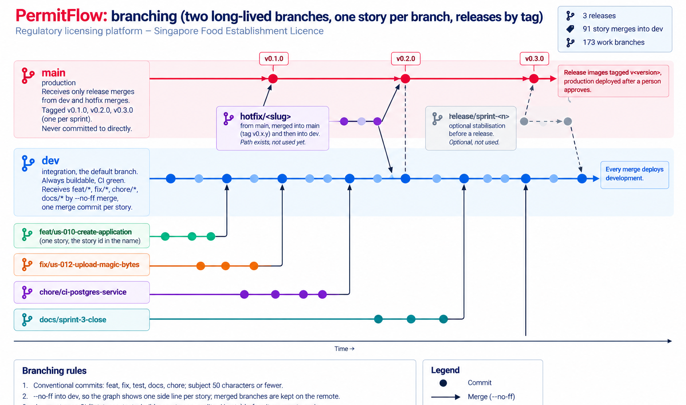

# PermitFlow: Git branching strategy

Two long-lived branches, short-lived work branches, merges only through the chain below. No direct commits to `main`.



```
main  ── production. Only receives merges from dev (release) or hotfix/*. Tagged on every release.
  └── dev  ── integration. Always buildable; CI must be green. Receives merges from feat/*, fix/*, chore/*, docs/*.
        ├── feat/us-010-create-application
        ├── fix/us-012-upload-magic-bytes
        ├── chore/ci-postgres-service
        └── docs/sprint-1-close
hotfix/<issue>  ── branched from main, merged into main AND dev.
```

## Branches

| Branch | From | Merges into | Lifetime | Naming |
|--------|------|-------------|----------|--------|
| `main` | none | none | permanent | |
| `dev` | `main` | `main` (release) | permanent | |
| `feat/*` | `dev` | `dev` | one story | `feat/us-<id>-<slug>` |
| `fix/*` | `dev` | `dev` | one bug found before release | `fix/<slug>` or `fix/us-<id>-<slug>` |
| `chore/*` | `dev` | `dev` | tooling, CI, deps | `chore/<slug>` |
| `docs/*` | `dev` | `dev` | documentation only | `docs/<slug>` |
| `hotfix/*` | `main` | `main` then `dev` | production bug | `hotfix/<slug>` |
| `release/*` | `dev` | `main` and back into `dev` | optional stabilisation before a release | `release/sprint-<n>` |

## Rules

1. One story per `feat/*` branch. The branch name carries the story ID so the commit history maps to Notion and `USER_STORIES.md`.
2. Merge into `dev` with `--no-ff` so each story is one visible merge commit; the local branch may be deleted after merge, the remote copy is kept so the history reads branch by branch.
3. Commits are conventional: `feat:`, `fix:`, `test:`, `docs:`, `chore:`, `refactor:`; subject aimed at 50 characters and never over 72; body explains why when not obvious. No tool attribution.
4. `main` is protected on GitHub (since 20 Sep 2026): changes arrive only through a pull request from `dev` whose CI checks (Backend, Frontend, AI gate, End to end, Secret scan, Dependency and code audit) have passed; no force pushes, no deletion, the rule applies to the owner too. `dev` is protected against force pushes and deletion; story branches merge into it locally with `--no-ff` and CI runs on every push.
5. A release is the pull request `dev` into `main`, merged when green, then a git tag `v0.<release>.0` on that merge commit (the first three releases were one per sprint, `v0.1.0` to `v0.3.0`; from v0.4.0 a release spans several sprints, and `dev` carries the working version `0.4.0-dev` until the bump). Before the release: bump `frontend/package.json` `version` to the same number and add the version's entry to `RELEASE_NOTES.md` (what is new, improved, and known limitations, in the users' words); a release without its notes is not tagged. The version: it is shown in the app shell and landing footer, and CI refuses a tag that does not match it. Only a push of a `v*` tag makes CI write the `:v0.x.0` image tags (branch pushes write `sha-<commit>` and the branch name), so a release image can never be overwritten by a later merge. Production runs a pinned `sha-<commit>` image; a release changes that pin, then the approved deploy job rolls it out; rollback is the previous pin and the same job. A migration in a release must keep the schema readable by the previous release (`OPERATIONS.md`, Migrations), so the rollback stays safe.
6. A hotfix branches from `main`, merges into `main` (tag `v0.x.y`), then into `dev` so the fix is not lost.
7. Nothing is pushed without the user's explicit confirmation in that turn (project rule). `dev` to `main` goes through a pull request; story branches into `dev` are local `--no-ff` merges.
8. History is never rewritten on `main` or `dev`. Work branches may be rebased on `dev` before merge.

## Day-to-day

```
git switch dev
git switch -c feat/us-010-create-application
# work, test, commit
git switch dev
git merge --no-ff feat/us-010-create-application -m "feat: create application (US-010)"
git branch -d feat/us-010-create-application
```

Sprint close: `docs/sprint-<n>-close` branch for `CHANGELOG.md` and doc updates, merged into `dev`; then `dev` → `main` with tag.

## Branch history on GitHub

Merged feature branches are kept on the remote (not deleted) so the development history is visible branch by branch: `feat/us-000-project-skeleton` through `feat/us-015-submit-application`, then `feat/frontend-redesign`, `feat/landing-polish` and `feat/dashboard-split` for the Sprint 1 design pass. Every one enters `dev` through a `--no-ff` merge, so the graph shows one side line per story. Locally, branches may be deleted after merge; the remote copy stays.
