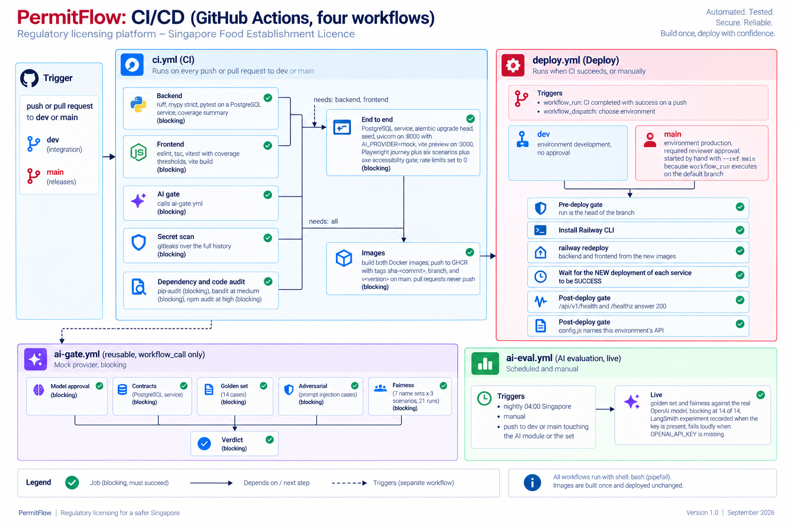
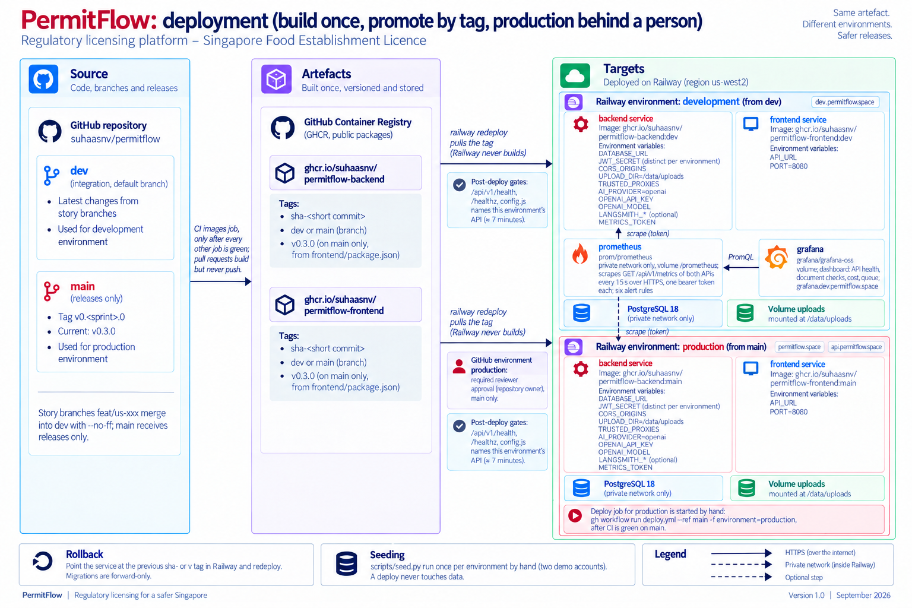

# PermitFlow: operations guide

Status: growing with each story. Everything here describes what exists in the code today.

## Local setup

See `README.md` (Docker for PostgreSQL, uv for the backend, npm for the frontend). `docker compose up -d db` starts PostgreSQL 16 and creates two databases on first start: `permitflow` (development) and `permitflow_test` (pytest). `docker compose --profile full up` also builds and runs the backend container with a volume at `/data/uploads`.

## Environment variables

| Variable | Default | Used by | Notes |
|----------|---------|---------|-------|
| `APP_ENV` | `development` | backend | `development`, `test` or `production`. `test` selects `TEST_DATABASE_URL` and disables the login rate limiter. |
| `DATABASE_URL` | local Postgres | backend | Postgres only (`postgresql+psycopg://`). |
| `TEST_DATABASE_URL` | local `permitflow_test` | pytest, CI | Truncated between tests. |
| `JWT_SECRET` | empty | backend | Required (at least 16 random characters) in every environment, tests included; the `.env.example` placeholder is refused; the app does not start without it. |
| `JWT_EXPIRES_MINUTES` | `480` | backend | 8 hours. |
| `SESSION_IDLE_MINUTES` | `60` | backend | US-093: one live session per account; a session with no request for this long ends by itself, so a device left signed in never locks the account. The sign-in page quotes the number from the server's message. |
| `CORS_ORIGINS` | `http://localhost:3000` | backend | Comma separated allowlist. |
| `UPLOAD_DIR` | `./data/uploads` | backend | Local disk storage; Railway volume at `/data/uploads`. |
| `UPLOAD_MAX_BYTES` | `10485760` | backend | 10 MB per file. |
| `SITE_VISIT_DAY_GUARD` | `true` | backend | UAT run 5 (F12): Mark site visit done and the checklist submit wait for the confirmed visit date (Singapore date); the checklist draft can be filled before. `false` where a whole appointment must run in one sitting: the CI browser suite, `uat_edges.py` and `smoke_routes.py`, a demonstration environment. |
| `SEED_PASSWORD` | `PermitFlow!2026` | `scripts/seed.py` only | The operator, officer and spare officer demo accounts' password. Published on purpose for the local and development demonstration. In production a private value is the way to seed reviewer accounts; the published value is refused there unless `SEED_PUBLIC_DEMO=true`. |
| `SEED_ADMIN_PASSWORD` | falls back to `SEED_PASSWORD` outside production | `scripts/seed.py` only | The administrator's password. With `APP_ENV=production` the seed exits non-zero unless this is set and is not `PermitFlow!2026`. Never published. |
| `SEED_PUBLIC_DEMO` | unset (false) | `scripts/seed.py` only | US-103. Production demo accounts are opt-in. With `APP_ENV=production` and no `SEED_PUBLIC_DEMO=true` (and no private `SEED_PASSWORD`) the seed creates the administrator only; `true` (also `1`, `yes`, `on`) seeds the operator, officer and spare officer and allows the published password. Ignored outside production. |
| `STORAGE_BUDGET_BYTES` | `157286400` | backend | 150 MB per application across every document version, the clarification evidence and the licence (US-085); a further upload is refused with 422 `storage_budget` naming the room left. The Railway `uploads` volume is 5,000 MB (`describe-environment`, 21 Sep 2026): 33 applications at the ceiling, several hundred at the usual few megabytes each. Watch `permitflow_storage_bytes` and the `PermitFlowVolumeFilling` alert (US-089, at 80 %) and raise the volume before it fills; locally the gauge reads the whole disk. |
| `STORAGE_BACKEND` | `local` | backend | US-097, ADR-015: where uploads live. `local` is the disk under `UPLOAD_DIR` (today's behaviour). `s3` is an S3-compatible bucket; with it the app refuses to start unless `S3_BUCKET`, `S3_ACCESS_KEY_ID` and `S3_SECRET_ACCESS_KEY` are set. The switch, not a redeploy, is the rollback. See "Object storage" below. |
| `S3_ENDPOINT_URL` | empty | backend, copy script | The bucket's S3 endpoint. Empty means AWS. MinIO locally: `http://localhost:9000` (`http://minio:9000` inside Compose). A Railway bucket: the endpoint on its Credentials tab. |
| `S3_BUCKET` | empty | backend, copy script | The bucket name; one bucket per environment, never shared. Required with `s3`. |
| `S3_REGION` | `us-east-1` | backend, copy script | The bucket's region, as the provider gives it. |
| `S3_ACCESS_KEY_ID`, `S3_SECRET_ACCESS_KEY` | empty | backend, copy script | The bucket credentials. Required with `s3`. Secret: set in Railway Variables, never in the repository or an image. No default is a credential; the Compose values are MinIO's development login. |
| `S3_ADDRESSING_STYLE` | `auto` | backend, copy script | `auto`, `path` or `virtual`. MinIO needs `path`; a Railway bucket works with `auto` (use `virtual` if the provider requires it). |
| `LOGIN_RATE_LIMIT_PER_MINUTE` | `10` | backend | Failed attempts per IP per minute. |
| `RATE_LIMIT_PER_MINUTE` | `240` | backend | Every request per client IP, sliding minute; 429 with `Retry-After` beyond it. 0 disables. Per process (US-058). |
| `LOGIN_ATTEMPTS_PER_MINUTE` | `20` | backend | Sign-in attempts of any outcome per client IP per minute (each costs an Argon2 hash). 0 disables. |
| `MAX_DRAFTS_PER_USER` | `20` | backend | Open drafts an operator may hold; the next create is a 409. 0 disables. |
| `AI_RUNS_PER_USER_PER_DAY` | `60` | backend | Verification runs per applicant over a rolling day; beyond it a run is stored `unavailable` (`daily_limit_reached`) · development runs with `500` since 20 Sep 2026 (the demo operator hit 60 during the agent-driven acceptance run and a visitor's checks must not be refused); production keeps `60` and nothing is sent to the model. 0 disables. |
| `AI_RUNS_PER_DAY` | `1000` | backend | The platform-wide ceiling on model calls per rolling day: the cost brake. 0 disables. |
| `DB_POOL_SIZE` / `DB_MAX_OVERFLOW` / `DB_POOL_TIMEOUT_SECONDS` | 10 / 20 / 5 | backend | SQLAlchemy pool per process; when every connection is busy for longer than the timeout the request is answered 503 `unavailable` (US-044). Size for the number of uvicorn workers times concurrent requests |
| `TRUSTED_PROXIES` | empty | backend | Comma-separated proxy IPs whose `X-Forwarded-For` is trusted for every per-client limiter, or `*` when the platform edge proxy is the only peer (Railway) |
| `CLIENT_IP_HEADER` | `X-Real-IP` | backend | Behind a trusted proxy, the header the edge writes with the connecting client's address, read before `X-Forwarded-For` by every per-client limiter (Railway documents `X-Real-IP`; US-082, readiness row 25). Ignored without a trusted proxy; empty falls back to the forwarded chain |
| `TEST_LIVE_AI` | unset | tests | Set to `1` to let the pytest suite call the live OpenAI provider; otherwise tests force `AI_PROVIDER=mock` regardless of `.env`. |
| `AI_PROVIDER` | `mock` | backend | `mock` or `openai`. |
| `OPENAI_API_KEY` | empty | backend | Required when `AI_PROVIDER=openai`. |
| `OPENAI_MODEL` | `gpt-4.1-mini` | backend | Structured outputs required; `gpt-4.1-mini` measured fastest and cheapest for extraction on 19 Sep 2026 (see `docs/07-ai/AI_VERIFICATION_DESIGN.md`). |
| `AI_TIMEOUT_SECONDS` | `30` | backend | Per call. |
| `AI_CONFIDENCE_THRESHOLD` | `0.6` | backend | Below this, `verified` becomes `needs_review`. |
| `AI_MAX_TEXT_CHARS` | `20000` | backend | Extraction cap sent to the provider. |
| `LANGSMITH_API_KEY` | empty | backend | Turns on LangSmith tracing of every OpenAI check (US-055). Empty: no tracing, no network call. |
| `LANGSMITH_ENDPOINT` | `https://api.smith.langchain.com` | backend | Must match the organisation's region (fixed at sign-up): `eu.api.` for EU, `apac.api.` for APAC (Sydney). |
| `LANGSMITH_PROJECT` | `permitflow` | backend | Project name the traces land in; use one per environment (`permitflow-dev`, `permitflow`). |
| `LANGSMITH_HIDE_INPUTS` | `true` | backend | Keeps the document text and form section out of the trace; outputs (status, codes, confidence, summary, evidence quotes of at most 300 characters) stay. `false` only in development. |
| `METRICS_TOKEN` | empty | backend | Turns on `GET /api/v1/metrics` for Prometheus (US-077); the scraper presents it as a bearer token. Empty: the route answers 404. Generate with `openssl rand -hex 24`; one value per environment, the same value in that environment's Prometheus scrape config. |
| `METRICS_TARGET`, `METRICS_SCHEME`, `ENVIRONMENT_LABEL` | `host.docker.internal:8000`, `http`, `local` | Prometheus (Compose) | Where the local Prometheus scrapes and how it labels the environment; `backend:8000` with the `full` profile. Not read by the app. |
| `GRAFANA_ADMIN_USER`, `GRAFANA_ADMIN_PASSWORD`, `GRAFANA_ROOT_URL` | `admin`, `permitflow`, `http://localhost:3001` | Grafana (Compose) | The local Grafana sign-in and its public URL. Not read by the app. |
| `WORKER_CONCURRENCY` | `2` | backend | US-101: the ceiling for the "worker concurrency" platform setting (1 to this value). Stored and audited now; the worker reads it from US-098. |
| `TELEGRAM_BOT_TOKEN`, `TELEGRAM_CHAT_ID` | empty | backend (also Grafana and the bot) | US-101: the API posts one Telegram message for each platform settings change to this chat. Both empty: no message, no network call. The same bot and chat the monitoring layer uses (`OBSERVABILITY.md`, 5a); set them on the backend service as well. |
| `VITE_API_URL` | `http://localhost:8000/api/v1` | frontend | Build-time, read from `frontend/.env` (not the repo root). In the container the runtime `API_URL` wins. |

### Platform settings: the limits above are now ceilings (v0.5.0, US-101)

Eight of the variables above are the **default and the hard ceiling** of a setting an administrator can change from `GET/PUT /admin/settings` (no screen yet; the screens follow): `RATE_LIMIT_PER_MINUTE`, `LOGIN_ATTEMPTS_PER_MINUTE`, `AI_RUNS_PER_USER_PER_DAY`, `AI_RUNS_PER_DAY`, `MAX_DRAFTS_PER_USER`, `UPLOAD_MAX_BYTES` (never above 10 MB), `AI_MAX_TEXT_CHARS` and `WORKER_CONCURRENCY`. Three more settings have no variable: the AI pause switch (default off), the Telegram per-check message switch (default off) and the scanner fail mode (default closed; open is refused when `APP_ENV=production`).

- **With no override the environment value applies**, exactly as before. Removing an override (a revert to the first change) returns to it.
- **The panel can lower a value, never raise it above the variable, and never below a small minimum** (10 requests, 3 sign-in attempts, 1 for the quotas, 1 MB for uploads); it cannot switch a limit off. To raise a ceiling, change the variable and redeploy. An override above a ceiling that was lowered later is clamped to the new ceiling when it is read.
- **A variable set to 0 ("no limit") stays no limit** until an administrator sets a real value; the panel then lets them choose any value up to a fixed cap, never 0.
- **Overrides live in the database** (`platform_settings`, migration 0015; the history is in the audit trail), so a redeploy keeps them. Each API process caches them for 10 seconds, so a change reaches every process within 10 seconds. The cache reloads in a background thread on its own small connection pool (3 second connect timeout, 1 second statement timeout), so a slow or unreachable database never stalls a request: the last good snapshot keeps serving.
- **To see what is overridden:** `GET /admin/settings` as an administrator (overridden, who, why), or `SELECT key, value, reason FROM platform_settings`. To undo one without the panel, delete the row; the next read (within 10 seconds) is the environment value again.
- **`LOGIN_RATE_LIMIT_PER_MINUTE`** (failed sign-ins) is not a platform setting and stays environment-only; the administrator's password confirmation on a settings change counts against it.
- Migration order: apply migration 0015 before the new API serves traffic (the image does on start). If the table is missing the API logs `platform_settings_unreadable` and keeps the last good snapshot (the environment values only before the first load), so a late migration never takes a limit away.

## Seeding

`cd backend && uv run python scripts/seed.py` creates the demo operator (`operator@permitflow.example.sg`), officer (`officer@permitflow.example.sg`), administrator (`admin@permitflow.example.sg`, US-073) and the unprotected spare officer (`officer2@permitflow.example.sg`) if they do not exist, and marks the first three protected. `scripts/create_user.py --email ... --name ... --role officer` creates any other account (password from `CREATE_USER_PASSWORD` or a prompt, never an argument); the Users page does the same for a signed-in administrator. `SEED_PASSWORD` sets the operator, officer and spare officer password (default `PermitFlow!2026`). The public demonstration keeps that password on purpose (README, privacy policy); any deployment that is not a demonstration must set its own value and reset it on a schedule. The administrator password is separate: `SEED_ADMIN_PASSWORD`. Outside production it falls back to `SEED_PASSWORD`; with `APP_ENV=production` the script exits non-zero unless it is set to a private value other than the published one. **Production admin password: it must be rotated and must never be the published value.** The seed only creates missing accounts and leaves an existing password alone, so the administrator account already seeded in an environment keeps the published password until it is rotated by hand: write a new argon2 hash (`app.core.security.hash_password`) into that user's `password_hash` from a one-off command on the backend service, then confirm the old password is refused at sign-in. There is no in-app password reset by design. Share the private value with reviewers directly, never in the repository.

### Demo passwords per environment, and rotating an account (US-103)

| Environment | Operator, officer, spare officer | Administrator |
|---|---|---|
| Local, CI, browser suite | `SEED_PASSWORD`, default `PermitFlow!2026` (published) | falls back to `SEED_PASSWORD` unless `SEED_ADMIN_PASSWORD` is set |
| Development (Railway) | `SEED_PASSWORD` on the backend service, unset today, so the published default: a shared demonstration, documented in the README | `SEED_ADMIN_PASSWORD`, private |
| Production (Railway) | opt-in: not created unless `SEED_PUBLIC_DEMO=true` or a private `SEED_PASSWORD` is set; never printed in the README | `SEED_ADMIN_PASSWORD`, private, required |

How the seed behaves with `APP_ENV=production`:

| `SEED_PUBLIC_DEMO` | `SEED_PASSWORD` | Result |
|---|---|---|
| unset or not true | unset | the administrator only; operator, officer and spare officer are not created |
| unset or not true | private value | all four accounts; the three demo accounts get that private password |
| unset or not true | `PermitFlow!2026` | refused (exit non-zero, nothing created) |
| `true` | unset | all four accounts; the demo accounts get the published password |
| `true` | any | all four accounts with that value |

The seed never deletes or re-passwords an account that already exists, so the production demo accounts seeded on 19 Sep 2026 keep working and keep the published password until they are rotated or deactivated. To turn a production demo account off, deactivate it on the Users page (the operator, officer and administrator accounts are protected and cannot be deactivated there; the spare officer and any hand-made account can). To change its password, rotate it as below.

**Rotating an account's password (one environment at a time; owner-approved, not part of any deploy).** The app has no password reset by design, so rotation is a one-off command on the backend service, run interactively so the new value never lands in shell history, a ticket or the repository:

```bash
railway ssh --environment <development|production> --service backend -- .venv/bin/python - <<'PY'
import getpass
from datetime import UTC, datetime

from app.core.security import hash_password
from app.infra.db import session_factory
from app.repositories.sessions import SessionRepository
from app.repositories.users import UserRepository

emails = ["<account email>", "<another account email>"]  # the accounts to rotate, from the private notes
with session_factory()() as db:
    users, sessions = UserRepository(db), SessionRepository(db)
    for email in emails:
        user = users.get_by_email(email)
        assert user is not None, f"no such account: {email}"
        password = getpass.getpass(f"new password for {email} (12+ characters): ")
        assert len(password) >= 12
        user.password_hash = hash_password(password)
        sessions.revoke_live(user.id, datetime.now(UTC), "rotated")
    db.commit()
PY
```

Then, for each account: confirm the old password is refused at sign-in (401, "Email or password is incorrect.") and the new one works, and record the date in the private notes (never the value).

**The four hand-made backup accounts (created on 6 Oct 2026: two operators, two officers; they share the published password in both environments).** Their addresses are in the owner's private notes (`notes/demo/`, outside the repository). Rotate them in development and in production with the command above, one environment at a time, each time after the owner's yes. If a backup account is no longer wanted, deactivate it on the Users page instead; a deactivated account cannot sign in and its sessions end at once. The published-password accounts that are protected by the seed (`operator@`, `officer@`, `admin@permitflow.example.sg`) are rotated with the same command; production's administrator was rotated on 9 Oct 2026.

**Opting production in to the public demonstration.** Set `SEED_PUBLIC_DEMO=true` on the production backend service, run `scripts/seed.py` once, then remove the variable if the demonstration is over. Do this only for a deliberate public demonstration; the sign-in page and the privacy policy already say the demonstration accounts are shared.

## Uploads

Files are written under `UPLOAD_DIR` as `<application_id>/<random>.<ext>` (never the client file name), atomically via a `.part` temp file. Issued licence certificates live beside them as `<application_id>/licence-<licence_no>.pdf`, written by the approval transaction and referenced from `licences.stored_key` with a `sha256` (US-051). Deleting a document only clears `is_current`; the file stays for the revision history. Tests use `./data/test-uploads` and clean it after every test.

### Object storage (US-097, ADR-015)

Uploads can live in an S3-compatible bucket instead of the volume. The code is shipped dormant: `STORAGE_BACKEND` defaults to `local`, and nothing below changes behaviour until it is set to `s3`. Keys are the same on both backends (`<application_id>/<random>.<ext>`, `<application_id>/licence-<licence_no>.pdf`), so the database needs no change. Downloads still stream through the authorised API route; the bucket is private and no presigned or public URL exists. On a bucket `disk_usage()` is `(0, 0)`: the `volume_used` and `volume_total` gauges read 0, so the volume alert cannot fire and its dashboard row has no data (the `documents` and `attachments` gauges still count what is stored).

**Locally (MinIO).** `docker compose --profile storage up -d minio minio-init` starts MinIO (S3 on `:9000`, console on `:9001`, login `permitflow` / `permitflow-local`) and creates the bucket `permitflow-uploads`; the one-shot then exits. For a backend on the host set in `.env`: `STORAGE_BACKEND=s3`, `S3_ENDPOINT_URL=http://localhost:9000`, `S3_BUCKET=permitflow-uploads`, `S3_ACCESS_KEY_ID=permitflow`, `S3_SECRET_ACCESS_KEY=permitflow-local`, `S3_ADDRESSING_STYLE=path`. For the `full` profile only `STORAGE_BACKEND=s3` is needed (the backend service already carries the MinIO values). The default Compose path (`docker compose up -d db`) is unchanged and uses the disk. MinIO no longer publishes images of its own; Compose uses the Chainguard build.

**Moving an environment to the bucket.** Development first, one environment at a time, with the UAT pass between development and production. Production is flipped only at a release.

1. Create the bucket for that environment on Railway (one bucket per environment) and set `S3_ENDPOINT_URL`, `S3_BUCKET`, `S3_REGION`, `S3_ACCESS_KEY_ID`, `S3_SECRET_ACCESS_KEY` on the backend service. Leave `STORAGE_BACKEND` unset (`local`). Not done yet: the Railway buckets are staged separately.
2. Dry run, from a shell that has the backend's variables and the uploads volume (`railway ssh` into the backend service; in the image the script is `/app/scripts/copy_uploads_to_s3.py`, run as `cd /app && .venv/bin/python scripts/copy_uploads_to_s3.py`; from a checkout, `cd backend && uv run python scripts/copy_uploads_to_s3.py`). It prints what it would upload, what is already there and any conflict, and changes nothing. A conflict (an object with different content under the same key) stops the procedure: find out why before going on.
3. Copy: the same command with `--execute`. Each file is uploaded under the same key, read back from the bucket and compared by sha256; a copy that does not match is deleted and reported. Exit code 0 and `result: OK` mean every file is in the bucket and verified.
4. Verify: run step 3 again. It must report `uploaded and verified: 0 files`, `skipped` equal to the file count on the volume, `conflicts: 0` and `failures: 0`.
5. Flip: set `STORAGE_BACKEND=s3` and redeploy the backend service, in a quiet moment. Files uploaded between the last copy and the flip are not in the bucket, so run step 3 once more immediately before the flip; it is idempotent and copies only the difference. Then check `/api/v1/health`, open a document and a licence of an existing application (they stream from the bucket), upload a new file and download it, and look for `storage_error` in the logs.
6. Keep the volume and its files until the bucket has served a full release without incident. Nothing in this procedure deletes from the volume.

**Rollback.** Set `STORAGE_BACKEND=local` (or remove it) and redeploy: the application reads the volume again, which still holds every file copied from it. Files uploaded while the switch was on exist only in the bucket; copy them back before relying on the volume for them, or accept that those documents read as missing and are uploaded again. The reverse copy is not scripted yet. That is the reason to flip in a quiet moment, development first, and to keep the window short.

## Health

`GET /api/v1/health` → `200 {"status":"ok","database":"ok"}` or `503 {"status":"degraded","database":"unreachable"}`. Provider configuration is never exposed here.

The response also carries `version`, `commit` and `environment` (`APP_ENV`). The frontend reads `environment` and shows an amber "Development environment: test data only" strip above every page whenever it is not `production` (US-109); production shows no strip, so `APP_ENV=production` must be set there.

## Logs

JSON lines on stdout: one `request` line per request with `request_id`, method, path, status, duration and user id. The request id is echoed in the `X-Request-ID` response header and shown to users on 500 responses. No payloads or document text are logged.

## Migrations

`cd backend && uv run alembic upgrade head`. New migration: `uv run alembic revision --autogenerate -m "<what>"`, then review the file. The container image runs `alembic upgrade head` on start.

Compatibility rule (since 20 Sep 2026): a migration must leave the schema readable by the previous release. Add columns nullable or with a default; never rename or drop a column or table in the same release as the code that stops using it (drop it one release later). This is what keeps an image rollback safe: the older image runs against the newer schema without knowing it changed. Reviewed by hand on every migration; the five migrations shipped so far follow it.

## CI (US-006)



`.github/workflows/ci.yml`, eight jobs (the diagram above predates US-103 and shows the pipeline as of v0.4.1: it does not yet show the Semgrep job, the Trivy steps in the images job, the ZAP job in `deploy.yml` or `secret-history.yml`): backend (ruff, mypy, pytest on a Postgres service), frontend (lint, typecheck, vitest, build, the 250 KB bundle check), AI gate (calls `ai-gate.yml`: model approval, contracts, golden set, adversarial, fairness, verdict; all on the mock provider, blocking), dependency and code audit (pip-audit, bandit, npm audit, all blocking since US-058), E2E (the full stack started inside the job: Postgres service, `alembic upgrade head`, `scripts/seed.py`, uvicorn on :8000 with `AI_PROVIDER=mock` and a CI-only `JWT_SECRET`, `vite preview` on :3000, then `npm run e2e`), gitleaks, Semgrep (US-103: `p/owasp-top-ten`, `p/python` and `p/typescript` over `backend/app`, `backend/scripts` and `frontend/src`, pinned and run through `uvx`; blocking at ERROR severity, lower severities are only listed), and images (both Docker images built; on `dev` and `main` pushed to GHCR, after every other job, Semgrep included, is green). In the images job each image is first built into the runner and scanned by Trivy (US-103: HIGH and CRITICAL vulnerabilities that have a fixed version fail the job; accepted exceptions live in `.trivyignore` with a reason and a review date, and the file has no entries today), and only then built again for the push, which is a cache hit. The frontend Dockerfile runs `apk upgrade` so the nginx base image's packages are patched at build time. The E2E job needs the two test suites first. On failure it prints the last 200 lines of both server logs and uploads `playwright-report` and `test-results` as an artifact for seven days. CI does not deploy; `deploy.yml` does, after CI (see Deployment). `ai-eval.yml` is the fourth workflow (with `ai-gate.yml`, which CI calls): the golden set and the fairness check against the real OpenAI model, nightly at 04:00 Singapore, by hand, and on pushes to `dev` or `main` that touch the AI module or the set; blocking at 14 of 14; needs the `OPENAI_API_KEY` repository secret and skips nothing silently (it fails with a clear error when the secret is missing).

**Scheduled and post-deploy scanners (US-103).**
- `.github/workflows/secret-history.yml`: a gitleaks scan of the whole history of every branch and tag (`gitleaks detect --source . --log-opts="--all"`, the release binary pinned by version and SHA-256), weekly on Sunday 19:17 UTC (Monday 03:17 in Singapore) and by hand (`gh workflow run secret-history.yml`). It fails on any finding that is not in `.gitleaksignore` and uploads a redacted report on failure. How it was proven against a planted secret: `docs/06-security/SECURITY_REVIEW.md`, "Secret history scan".
- `deploy.yml`, job `zap-baseline`: after a successful development deploy, an OWASP ZAP baseline scan of https://dev.permitflow.space. Report only: the step is `continue-on-error`, no issue is written and the workflow stays green whatever ZAP finds; read the `zap-baseline-report` artifact on the run page. It never scans production.
- `.github/dependabot.yml`: weekly pull requests into `dev` for the backend (`uv`), the frontend (`npm`) and the workflows' actions, one grouped pull request per ecosystem. Each runs the full CI. Dependabot security alerts and security updates are switched on in the repository settings (below).

**Owner settings in GitHub (not set by any file in the repository).**
- Settings, Code security: enable *Dependency graph*, *Dependabot alerts* and *Dependabot security updates* (the version updates in `dependabot.yml` need none of these, but alerts and security updates do).
- Settings, Branches (the `main` protection rule): add `Semgrep` to the required status checks if it should be required by name. `Images` already needs it, so a failing Semgrep blocks `Images` either way.
- The scheduled scan, Dependabot and the post-deploy ZAP job read their files from the default branch (`main`); they start when this change reaches it with the release. Until then, `gh workflow run secret-history.yml --ref <branch>` runs the history scan from a branch where the file exists.

**Release guard.** On every `v*` tag the `images` job first runs `python3 scripts/release_guard.py "$GITHUB_REF_NAME"` (full history and tags fetched), before any image is built. A candidate tag `vX.Y.Z-rc.N` passes when the five version files carry `X.Y.Z-rc.N`. A release tag `vX.Y.Z` passes only when the files carry `X.Y.Z`, a candidate tag exists, and between the highest candidate and the release nothing under `backend/`, `frontend/`, `docker/` or `docker-compose.yml` changed except the version lines. Any other tag shape fails. The guard covers the older check that a tag equals the `frontend/package.json` version; the `Tags` step keeps that check too. The rules and the reasoning are in `RELEASING.md`.

## Deployment (US-007)

### Shape



One Railway project (`permitflow`), two environments that share nothing:

| | development | production |
|---|---|---|
| Deploys from | `dev` | `main` (release tags `v0.<sprint>.0`) |
| Images | `ghcr.io/suhaasnv/permitflow-backend:dev`, `...-frontend:dev` (moving tags, every merge) | pinned `sha-<commit>`: `sha-c1eea14` since 9 Oct 2026 (release v0.4.1, PR #17, tag `v0.4.1`, the first release cut from a tested candidate, `v0.4.1-rc.3`); `sha-ad06e23` from 8 Oct 2026 (release v0.4.0, PR #16, tag `v0.4.0`); before that `sha-714a159` from 20 Sep 2026, 16:16 SGT (v0.3.0 plus the post-release fixes recorded in `CHANGELOG.md`, the observability endpoint and the policy-page fix, deployed at the owner's decision without a new version; `sha-2226d11` served from 11:50 to 16:16 that day; the git tag `v0.3.0` and the `:v0.3.0` images still name the 19 Sep build `38df991`) |
| Frontend | https://dev.permitflow.space (US-052; Railway host https://frontend-development-afe2.up.railway.app) | https://permitflow.space (also `www`; Railway host https://frontend-production-2d8b.up.railway.app) |
| API | https://api.dev.permitflow.space/api/v1 (US-052; Railway host https://backend-development-4e04.up.railway.app/api/v1) | https://api.permitflow.space/api/v1 (Railway host https://backend-production-19cd.up.railway.app/api/v1) |
| State (19 Sep 2026) | live: deployed on every merge to `dev`, seeded | live since v0.3.0 (19 Sep, 17:00 SGT): images `ghcr.io/suhaasnv/permitflow-{backend,frontend}:main` attached, first deployment committed from the Railway staging area, then the approved `deploy.yml` run redeployed with the health gates; seeded once; production UAT recorded in `docs/10-uat/UAT_PLAN.md`; reset after the UAT and left with one example application (Serangoon Spice House, Application Received) |
| Database | own Postgres 18 service | own Postgres 18 service |
| Uploads | volume `uploads` at `/data/uploads` | own volume at `/data/uploads` |
| AI | `AI_PROVIDER=openai`, `gpt-4.1-mini` | same |

Two images, built once in CI and pulled by Railway (Railway never builds): `backend/Dockerfile` (uvicorn, runs `alembic upgrade head` on start) and `frontend/Dockerfile` (Vite build served by nginx; the API URL is written into `config.js` at container start from `API_URL`, so one image serves both environments). Images are public packages on GHCR, tagged `sha-<commit>` and with the branch name on every branch push. A release tag (`:v0.3.0`) is written only by the CI run for that git tag (`on: push: tags: v*`), and that run refuses a tag that does not match `frontend/package.json`; so a release image is immutable and a later merge to `main` cannot overwrite it (this was not the case before 20 Sep 2026: `v<version>` was written on every `main` push, and the `:v0.3.0` tag did get rewritten with documentation-only commits; the running production containers were and are the `sha-38df991` build).

### Continuous deployment, one push at a time

1. Push to `dev` (or `main`). `ci.yml` runs: backend, frontend, AI verification, gitleaks, dependency audit, then the E2E job against a stack started in the runner.
2. Green → the `images` job builds both images and pushes them to GHCR (`:dev` or `:main`, plus `sha-<commit>`). Pull requests build but never push. A `v*` tag push runs CI again and writes the `:v0.x.0` tags.
3. `deploy.yml` runs when CI completed successfully on that branch. Using the environment's `RAILWAY_TOKEN` it calls `railway redeploy --from-source` for `backend` and `frontend` in the matching Railway environment, which pulls the new images.
4. The job records the deployment id that is live before the redeploy and then waits until Railway reports a deployment with a different id as SUCCESS (a redeploy call returns before the rollout, and the old containers keep answering meanwhile; accepting the first SUCCESS in the list would pass on the previous rollout, which the job did until 20 Sep 2026); Railway's own health checks (`/api/v1/health`, `/healthz`) gate the rollout too.
5. Production: the production services do not track a branch tag; each is pinned to the release image `sha-<commit>` in Railway. A release is: merge the `dev` pull request into `main`, tag `v0.x.0`, wait for the tag's CI run, set both production services to `sha-<release commit>` (Railway dashboard, service Settings, Source), then run the deploy job by hand: `gh workflow run deploy.yml --ref main -f environment=production`. The job pauses at the GitHub `production` environment until a required reviewer (the repository owner) approves it in the Actions run. Development needs no approval. Known limit, found at the v0.3.0 release: a `workflow_run`-triggered job executes on the repository's default branch (`dev`), and the production environment's branch policy admits only `main`, so an automatic production job would be rejected before its first step. The workflow therefore listens for CI on `dev` only and production is deployed by hand: `gh workflow run deploy.yml --ref main -f environment=production` after CI is green on `main`; the approval gate still applies. (Making `main` the default branch would restore the automatic path; not done, because `dev` is where pull requests land.) Either environment can also be redeployed from its current images by hand with "Run workflow" on the Deploy workflow (choose the environment), for example after a platform incident.
6. Post-deploy gates: `/api/v1/health` and `/healthz` must answer 200 within about seven minutes, and the frontend's `config.js` must name that environment's API. A failed gate marks the deployment red; the previous containers keep serving until the new ones are healthy (Railway's default).

The GitHub `production` environment only accepts deployments from `main`. Development and production cannot affect each other: separate databases, volumes, secrets, URLs, and a project token scoped to one environment each.

### Secrets and variables

| Where | Name | Purpose |
|---|---|---|
| Railway backend service (per environment) | `APP_ENV`, `DATABASE_URL` (`${{Postgres.DATABASE_URL}}`), `JWT_SECRET` (distinct per environment), `JWT_EXPIRES_MINUTES`, `SESSION_IDLE_MINUTES` (optional), `CORS_ORIGINS` (that environment's frontend URL), `UPLOAD_DIR=/data/uploads`, `TRUSTED_PROXIES=*` (the Railway edge is the only peer), `CLIENT_IP_HEADER` (default `X-Real-IP`, the header Railway documents for the client address), `AI_PROVIDER`, `OPENAI_API_KEY`, `OPENAI_MODEL`, `LANGSMITH_API_KEY`, `LANGSMITH_ENDPOINT`, `LANGSMITH_PROJECT`, `LANGSMITH_HIDE_INPUTS` (optional, tracing), `DB_POOL_SIZE`, `DB_MAX_OVERFLOW`, `PORT=8000`; development only: `SITE_VISIT_DAY_GUARD=false` (set 24 Sep 2026, so a walkthrough can record a visit the day it is arranged; production leaves it unset, the rule on) | runtime configuration |
| Railway frontend service (per environment) | `PORT=8080`, `API_URL` | written into `config.js` at start |
| GitHub environment secret (`development`, `production`) | `RAILWAY_TOKEN` | a Railway **project token** scoped to that one environment (Project settings, Tokens); created by the owner in the dashboard |
| GitHub repository variable | `RAILWAY_PROJECT_ID` | which project to redeploy |
| GitHub repository secret | `OPENAI_API_KEY` | the live AI evaluation (`ai-eval.yml`); a key of its own, so it can be rotated apart from the runtime key (`gh secret set OPENAI_API_KEY`) |
| GitHub repository secret and variable (optional) | `LANGSMITH_API_KEY`, `LANGSMITH_ENDPOINT` | when present, `ai-eval.yml` also records each run as a LangSmith experiment (US-055); the secret is set, the endpoint is the US default |
| GitHub environment variables | `BACKEND_URL`, `FRONTEND_URL` | the post-deploy gates |

`postgresql://` URLs from Railway are accepted as-is: settings add the `+psycopg` driver.

### Seeding

The database starts empty. `scripts/seed.py` creates the four demo accounts only (idempotent; the administrator and the spare officer since US-073, 21 Sep 2026: re-run it once per environment when v0.4.0 deploys). It is not part of a deploy on purpose, a deploy must never touch data; run it once per environment: `railway ssh --environment development --service backend -- .venv/bin/python scripts/seed.py` (and `--environment production` for production). Development was seeded on 19 Sep 2026; production on 19 Sep 2026 after the v0.3.0 deploy. Accounts in the development environment: `operator@permitflow.example.sg` and `officer@permitflow.example.sg`, password `PermitFlow!2026` (the `SEED_PASSWORD` default; deliberately public for the demonstration, see the privacy policy). Production's demonstration accounts are opt-in since US-103 and its password is no longer printed in the README (see Seeding, "Demo passwords per environment"). The administrator account is the exception: its password is `SEED_ADMIN_PASSWORD`, private, and the seed refuses to run in production without it (see Seeding). To change a password, set the variable and re-run the seed: existing accounts keep their password (the script is create-only), so a rotation is a new seed plus a manual update, or a reset of the environment.

### Custom domain (US-052)

Both environments live on the owner's domain with one convention: the environment name is a subdomain, the API is `api.` in front of it.

| | Frontend | API |
|---|---|---|
| production | `permitflow.space`, `www.permitflow.space` | `api.permitflow.space` |
| development | `dev.permitflow.space` | `api.dev.permitflow.space` |

In Railway, per environment: frontend service → Settings → Networking → Custom domain (the frontend hosts); backend service → the API host. Railway shows the CNAME target for each; the owner adds those records at the registrar (the apex `permitflow.space` may need the registrar's ALIAS/ANAME record or Railway's provided A records; the others are plain CNAMEs). Then set per environment: backend `CORS_ORIGINS` to that environment's frontend origins, frontend `API_URL` to that environment's API host plus `/api/v1`; GitHub environment variables `FRONTEND_URL` and `BACKEND_URL` to the same hosts so the deploy health gates check them. The railway.app hosts keep working as fallbacks. TLS is issued by Railway once DNS resolves (minutes to an hour).

### Observability (US-077)

Three layers: structured request logs with a request id (`core/logging.py`), LangSmith traces for the AI checks (US-055, inputs hidden), and Prometheus metrics with a Grafana dashboard and seven alert rules. The full description (every metric family and label, the dashboard rows, the alert rules, the local profile, the Railway services, the security controls, what is still missing) is `docs/13-observability/OBSERVABILITY.md`; what an operator needs day to day:

- `GET /api/v1/metrics` is off unless `METRICS_TOKEN` is set, needs that bearer token, is exempt from the per-client limiter and never counts itself. One token per environment; the same value sits in that environment's Prometheus configuration. Rotate by setting the new value on the backend and in the Prometheus variable, then redeploying both.
- Locally: `docker compose --profile observability up -d` (Prometheus `:9090`, Grafana `:3001`, sign-in from `GRAFANA_ADMIN_*`); the dashboard JSON is generated by `docker/observability/grafana/build_dashboard.py`, never edited by hand.
- On Railway (development environment, three services): `prometheus` (private network only, volume `/prometheus`, config in `PROMETHEUS_CONFIG` and `PROMETHEUS_ALERTS`, tokens in `DEV_METRICS_TOKEN` and `PROD_METRICS_TOKEN`, `RAILWAY_RUN_UID=0` because the image runs as a non-root user and volumes mount as root) scrapes both APIs over HTTPS; `grafana` (volume `/var/lib/grafana`, `PORT=3000`, healthcheck `/api/health`, provisioning files written at start from `GF_PROVISION_*` and `GF_DASHBOARD_PERMITFLOW`, `RAILWAY_RUN_UID=0`) is public at `https://grafana.dev.permitflow.space` (CNAME and `_railway-verify` TXT at Namecheap), sign-in only. The variable names and the start commands are recorded in `docs/13-observability/OBSERVABILITY.md`; secrets are set by the owner from the CLI, never through the assistant. `PROMETHEUS_ALERTS` is a copy of `docker/observability/alerts.yml`: when the file changes (last on 21 Sep 2026, every rule grouped by environment), the variable is re-set from it and `prometheus` redeployed, or the old rules keep running.
- Alerts reach Telegram: Grafana sends the seven incident rules and an hourly digest per environment to the owner's chat, and a small bot (`telegram-bot`, third Railway service) answers `/status`, `/dev`, `/prod`, `/checks`, `/cost`, `/queue`, `/alerts`. The Railway start commands and variables: `docker/observability/railway/README.md`.

### Rollback

Three layers, one solved, two planned.

**Code (solved).** Every image carries a `sha-<commit>` tag and every release a `v<version>` tag, and production is pinned to a `sha-` tag, so a rollback is: set the two production services back to the previous release's `sha-` tag in the Railway dashboard and run the deploy job (approval and health gates apply). Development tracks `:dev` and rolls back by pointing at a `sha-` tag the same way. Migrations are forward-only; a rollback that needs a schema change is a new migration.

**Schema (rule, not tooling).** There is no `alembic downgrade` in production. The compatibility rule under Migrations (add nullable, drop one release later) is what makes a code rollback safe across a release that changed the schema; the older image reads the newer tables. A release that cannot honour the rule ships its schema change one release ahead of the code that needs it.

**Data (planned, readiness rows 13 and 14).** Today: Railway's managed Postgres backups (point-in-time restore from the dashboard), no backup of the uploads volume, no restore drill. Before real users: a nightly `pg_dump` and a copy of the uploads volume to object storage (30 days), one restore drill into a scratch environment, and a staging environment cloned from production data so a migration is rehearsed before it reaches production. Order: backups and the drill first, staging second.

**Observability.** The two monitoring services roll back like any image service (previous tag, redeploy); their data volumes persist. A wrong dashboard or rule is a variable: set the previous file content and redeploy.

**Configuration.** A wrong variable (a CORS origin, a quota, a model name) is rolled back by setting the previous value in Railway (Variables) and redeploying; Railway keeps the variable history per service, so the previous value is visible there. The values that matter are listed in the Secrets and variables table above; nothing is derived at build time except the frontend's `API_URL`, which is read at container start.

**AI prompt.** The verifier's prompt is versioned in code (`PROMPT_VERSION` in `openai_provider.py`, stamped on every run and trace). A bad prompt is rolled back like any code change: previous pin, deploy job. Runs made under the bad version stay in the database with their version, so they can be listed and re-run (the re-run button, or a script over `verification_runs` where `prompt_version = ...`).

**Secrets.** Rotation, not rollback: a new `JWT_SECRET` signs every user out (8 hour tokens, accepted); `OPENAI_API_KEY` and `LANGSMITH_API_KEY` are replaced in Railway and, for the evaluation workflow, in the GitHub repository secret, then the service restarts. The OpenAI key is due for rotation after the assessment; the LangSmith key expires on its own after three months.

**A rollout that never became healthy** needs no rollback: Railway keeps the old containers serving until the new ones pass `/api/v1/health` and `/healthz`, and the deploy job goes red.

### Verified

Development: both health endpoints 200 after the first commit, demo accounts seeded, and `e2e/scenarios/02-reaches-officer.spec.ts` passed against the live URLs (19 Sep 2026).

Production, v0.4.1 (9 Oct 2026): both services staged onto `sha-c1eea14` and the staged change committed (only the two image fields changed); `/health` answers `{"version": "0.4.1", "commit": "c1eea14", "environment": "production"}`; `/api/v1/metrics` answers 401 without the token; `/`, `/login` and `/releases` answer 200; in a headless browser the build line reads "v0.4.1 (c1eea14) · production", What's new lists v0.4.1 and no candidate, no environment strip, the sign-in logo sits where the landing page has it, and the sign-in page no longer shows the published password; the administrator's published password answers 401 (rotated by hand on 9 Oct, `SEED_ADMIN_PASSWORD` set on the production backend). No seed run needed (no new accounts). Rollback: set both services back to `sha-ad06e23` and redeploy.

Production, v0.4.0 (8 Oct 2026): both services staged onto `sha-ad06e23` and the staged change committed; `/health` answers `{"version": "0.4.0", "commit": "ad06e23", "environment": "production"}`; `/api/v1/metrics` answers 401 without the token; the site and `/releases` answer 200 with the 0.4.0 bundle; the seed run once (the administrator and the spare officer created, four accounts). Rollback: set both services back to `sha-714a159` and redeploy.

Development, v0.4.0-rc.2 (21 Sep 2026, evening, `dev` at `2be052a`, CI runs 35607398711 (dev) and 35607410789 (tag) green, deploy run 35608475721): the API answers `{"version": "0.4.0-rc.2", "commit": "2be052a", "environment": "development"}` on `/health`, the frontend bundle carries `0.4.0-rc.2` and the release notes (`/releases`); the seed unchanged.

Development, v0.4.0-rc.1 (21 Sep 2026, `dev` at `8cf669f`, CI run 35559385079 green after one accessibility fix, deploy run 35560009743 with both post-deploy gates): the seed run once (the administrator and the spare officer created, four accounts), the API answers `0.4.0-rc.1` with 61 routes, the frontend bundle carries the version, the administrator and the spare officer sign in and read their pages, the limiter check of readiness row 25 passed, and the `prometheus` service was redeployed with `PROMETHEUS_ALERTS` re-set from `docker/observability/alerts.yml` (rules by environment). Production untouched on `sha-714a159`.

Custom domain (US-052, 19 Sep 2026): five hostnames registered on Railway, ten DNS records at Namecheap (ALIAS at the apex, four CNAMEs, five `_railway-verify` TXT records, one per hostname), all five certificates issued within about 30 minutes. `CORS_ORIGINS` and `API_URL` set per environment; GitHub environment variables moved to the new hosts. Deploy run #6 (manual, development) green with the gates against `https://dev.permitflow.space` and `https://api.dev.permitflow.space`; scenario 02 passed through the domain with the CORS header confirmed. Note learned: Railway needs a TXT verification record per hostname, not only at the apex; deploy run #5 failed its config.js gate only because it ran between the variable change and the GitHub variable update.
