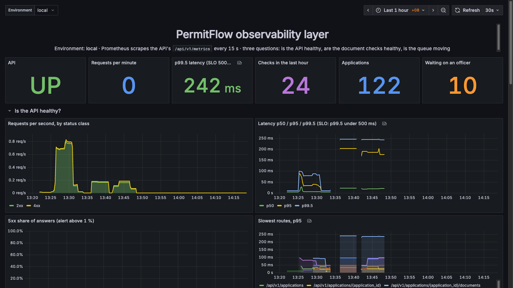
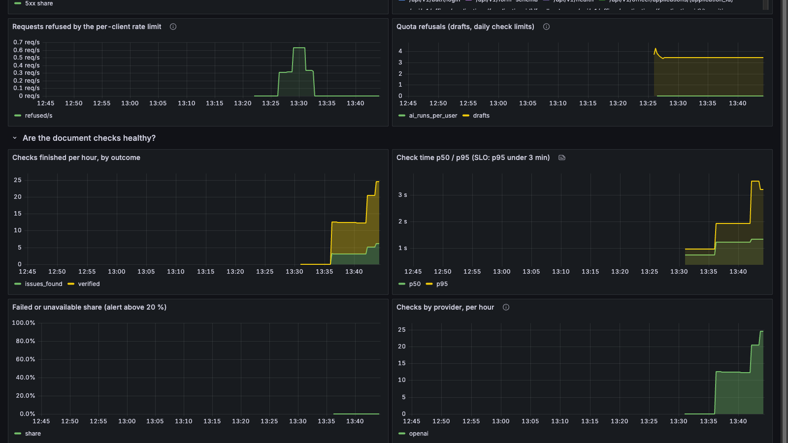
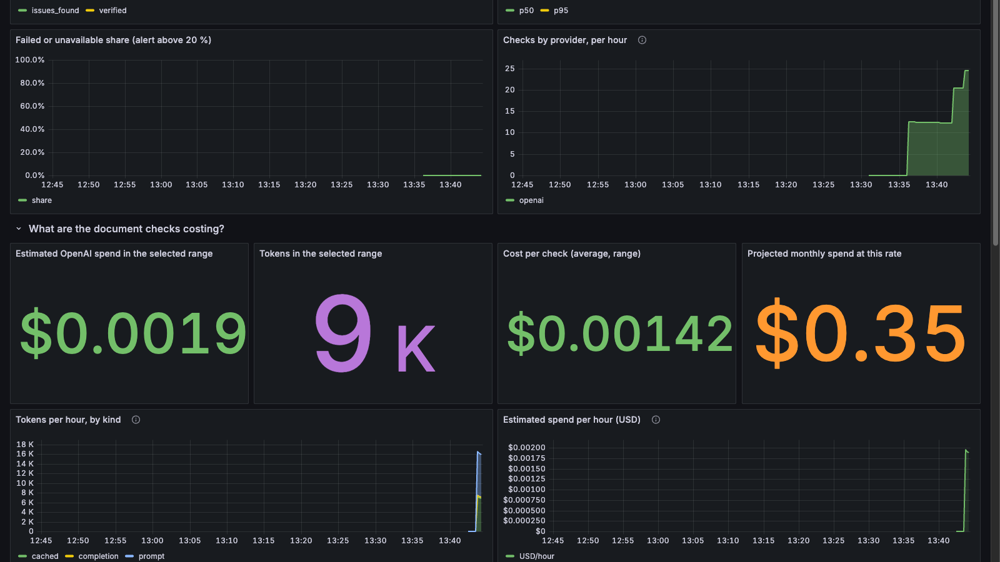
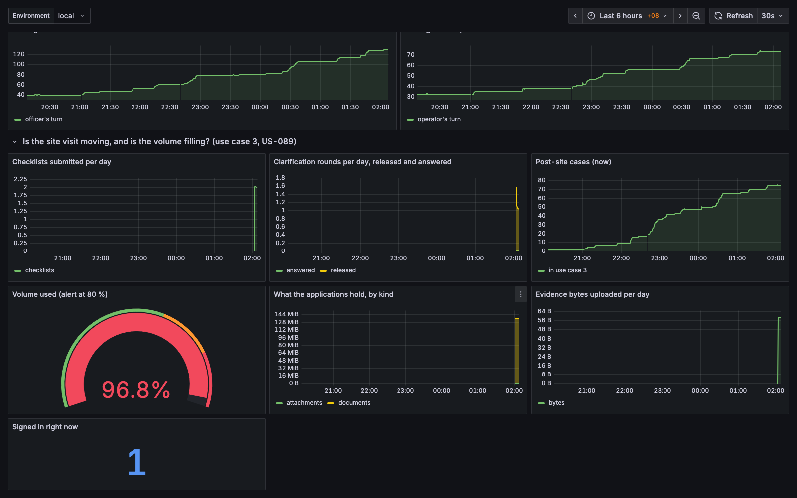
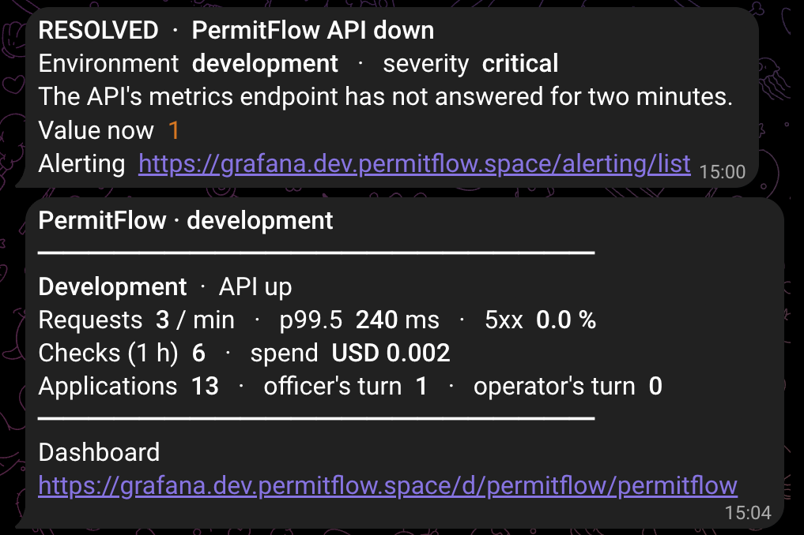

# Observability: Prometheus and Grafana

What the platform tells about itself, how it is collected, what the dashboard answers, what fires an alert, how it runs locally and on Railway, and what is still missing. Built 20 Sep 2026 (US-077) after a cold review of the debrief decks named observability as the one production-readiness story the repository did not tell. Beyond the assessment brief; recorded in `SCOPE.md` as C9 and in `docs/11-reviews/PRODUCTION_READINESS_REVIEW.md` row 24.



## 1. Three layers of telemetry

| Layer | Since | What it carries | Where it goes |
|-------|-------|-----------------|---------------|
| Structured request logs | Sprint 1 (US-006) | One JSON line per request: request id, method, path, status, duration; verification runs log their outcome, provider, model and latency | stdout, Railway's log viewer |
| LangSmith traces | Sprint 3 (US-055) | One trace per OpenAI check with the document type, text length, tokens and latency; inputs hidden by default | LangSmith, off without a key |
| Prometheus metrics | 20 Sep (US-077) | Counters and histograms below, scraped every 15 s | Prometheus, drawn by Grafana, watched by seven alert rules; alerts, an hourly digest and command replies on Telegram |

Logs answer "what happened to this request"; traces answer "what did the model see and say"; metrics answer "is the platform healthy right now and what is it costing". None of the three carries document text, a personal name or an id in a metric label.

## 2. The metrics endpoint

`GET /api/v1/metrics` (`backend/app/api/v1/metrics.py`) renders the process's counters and histograms in the Prometheus text format.

- Off unless `METRICS_TOKEN` is configured: the route answers 404, so an unconfigured deployment exposes nothing.
- With a token configured, the request must carry `Authorization: Bearer <token>`, compared with `secrets.compare_digest`; anything else is 401 in the standard error envelope.
- Exempt from the per-client rate limiter (`core/rate_limit.py`): the monitor must keep answering while a client is being refused, which is exactly when the numbers matter.
- The scrape does not count itself (`core/metrics.py`, the middleware skips its own route).
- The by-status gauge is refreshed on each scrape from one `GROUP BY` query (`services/metrics.py`, `ApplicationRepository.count_by_status`).

Counters are per process and reset on restart; Prometheus's `rate()` and `increase()` are built for that, and the dashboard uses nothing else.

## 3. The metric families

All names carry the `permitflow_` prefix. Labels are route templates and enum values only; a label never carries an id, a name or text.

| Family | Type | Labels | Incremented where |
|--------|------|--------|-------------------|
| `permitflow_http_requests_total` | counter | `method`, `route` (template, e.g. `/api/v1/applications/{application_id}`), `status` | the outermost middleware in `main.py`, every answer including 429s |
| `permitflow_http_request_seconds` | histogram | `method`, `route` | same middleware; buckets from 10 ms to 10 s |
| `permitflow_rate_limited_total` | counter | none | the limiter middleware in `main.py` on every 429 |
| `permitflow_verification_runs_total` | counter | `outcome` (verified, issues_found, needs_review, unreadable, failed, unavailable), `provider` (openai, mock, none) | `services/verification.py` when a run finishes; `services/quotas.py` for runs refused before any provider ran (`provider="none"`) |
| `permitflow_verification_run_seconds` | histogram | `provider` | `services/verification.py`, extraction plus model plus rules; buckets from 0.1 s to 60 s |
| `permitflow_quota_refusals_total` | counter | `quota` (drafts, ai_runs_per_user, ai_runs_per_day) | `services/quotas.py` |
| `permitflow_transitions_total` | counter | `target` (the new status), `actor` (operator, officer) | the four services that commit a status change: `workflow.py`, `submission.py`, `resubmission.py`, `withdrawal.py`, after the commit |
| `permitflow_applications` | gauge | `status` | refreshed on each scrape |
| `permitflow_sessions_active` | gauge | none | accounts signed in right now (US-093: not revoked, not idle, token unexpired); refreshed on each scrape |
| `permitflow_checklists_submitted_total` | counter | none | `services/checklist.py` after the submit commits (US-089) |
| `permitflow_clarification_rounds_total` | counter | `event` (released: round 1 at the checklist submit and every Request another round; answered: every Send responses) | `services/checklist.py`, `services/workflow.py`, `services/clarification.py`, after the commit |
| `permitflow_attachment_bytes_total` | counter | none | `services/clarification.py` after an evidence file is stored (the stored size, after metadata stripping) |
| `permitflow_storage_bytes` | gauge | `kind` (documents, attachments: the database sums; volume_used, volume_total: `shutil.disk_usage` of the upload directory, the mounted volume on Railway, the whole disk locally) | refreshed on each scrape |
| `permitflow_openai_tokens_total` | counter | `model`, `kind` (prompt, cached, completion) | `infra/ai/openai_provider.py` from the `usage` OpenAI returns on every call |

Tests: `backend/tests/integration/test_metrics.py` (off without a token, 401 with a wrong one, the families present after a round, the scrape not counted, the use case 3 counters and the storage gauge moving through a checklist submit, a released and an answered round and an evidence upload), plus assertions in `test_openai_provider_paths.py` (tokens counted) and `test_rate_limit.py` (exemption).

## 4. The dashboard

One dashboard, `PermitFlow`, generated by `docker/observability/grafana/build_dashboard.py` into `dashboards/permitflow.json` (edit the script, run it; never edit the JSON). The `Environment` variable selects `local`, `development` or `production`; every query is filtered by it.

- **Header and stat strip.** API up or down, requests per minute, p99.5 latency against the 500 ms objective, checks in the last hour, applications, waiting on an officer.
- **Is the API healthy?** Requests per second by status class; latency p50, p95, p99.5; 5xx share of answers; the slowest routes at p95; requests refused by the per-client limit; quota refusals by quota.
- **Are the document checks healthy?** Checks finished per hour by outcome; check time p50 and p95 against the 3 minute objective; failed-or-unavailable share; checks by provider.
- **What are the document checks costing?** Spend in the selected range, tokens, cost per check, projected monthly spend at the current rate, tokens and dollars per hour, at gpt-4.1-mini's list price (USD 0.40 per million input tokens, 0.10 cached input, 1.60 output; `developers.openai.com/api/docs/pricing`, checked 20 Sep 2026). An estimate from the usage the API reports; the OpenAI invoice is the truth.
- **Is the queue moving?** Applications by status now; transitions per hour by target status; waiting on the officer; waiting on the operator. "Whose turn" follows `domain/admin.py` since US-089: the officer's turn is every open status the operator is not asked to act on (including Under Review and the two visit statuses), the operator's turn is the two resubmission statuses and Awaiting Post-Site Clarification.
- **Is the site visit moving, and is the volume filling?** (US-089) Checklists submitted per day; clarification rounds per day, released and answered; post-site cases now; the volume used as a gauge with the 80 % threshold; what the applications hold by kind; evidence bytes uploaded per day; accounts signed in right now.







## 5. The alert rules

`docker/observability/alerts.yml`, evaluated by Prometheus every 15 s. The service-level objective they encode: 99.5 % of API requests under 500 ms, a document check finished within three minutes, 5xx under 1 %. Every expression aggregates `by (environment)`: one Prometheus scrapes both environments, so production and development each fire their own alert and neither can dilute or mask the other (until 21 Sep 2026 four of the rules summed across both, a review finding; the Grafana-managed twins always kept the label). On Railway the file lives in the `PROMETHEUS_ALERTS` variable: after a change to `alerts.yml`, paste the new file into that variable and redeploy the `prometheus` service, or the running instance keeps the old rules.

| Rule | Condition | For | Severity |
|------|-----------|-----|----------|
| `PermitFlowApiDown` | `up{job="permitflow-api"} == 0` | 2 min | critical |
| `PermitFlowApiErrorBurst` | 5xx share over five minutes above 1 % | 5 min | critical |
| `PermitFlowApiSlow` | p99.5 latency over ten minutes above 500 ms | 10 min | warning |
| `PermitFlowChecksFailing` | failed or unavailable share over thirty minutes above 20 % | 15 min | warning |
| `PermitFlowChecksSlow` | check p95 over thirty minutes above 180 s | 15 min | warning |
| `PermitFlowRateLimiting` | more than one refusal a second over five minutes | 10 min | info |
| `PermitFlowVolumeFilling` | the upload volume more than 80 % full (`volume_used / volume_total`) | 15 min | warning |

These rules are evaluated by Prometheus and shown on its Alerts page. The same seven conditions are also provisioned as Grafana-managed rules (`docker/observability/grafana/build_alerting.py`, one alert per environment from the `environment` label) because Grafana is what notifies: see the next section.

## 5a. Telegram: alerts, an hourly digest, and commands



Three things reach one Telegram chat, all through one bot (`@permitflow_space_monitor_bot`, created with @BotFather on 20 Sep):

- **Incident alerts from Grafana.** The seven rules above, provisioned as Grafana alert rules with a Telegram contact point (`docker/observability/grafana/alerting/`). A firing rule sends `FIRING · <rule>` with the environment, the severity, the summary and the value; a resolved one sends `RESOLVED`. Grouped by rule and environment, repeated every four hours while a condition holds.
- **An hourly digest from Grafana.** Grafana OSS has no scheduled reports, so the digest is an always-firing rule per environment (`PermitFlow hourly digest (development)`, `(production)`, `(local)`) whose annotations carry the numbers, and a notification policy that repeats it every hour. One message with a section per environment that Prometheus is scraping: API up or down, requests per minute, p99.5 latency, checks and their spend in the hour, applications, who is waiting. An environment that is not scraped stays silent (NoData is OK). Change `repeat_interval` on the digest route to `24h` for a morning summary.
- **Commands, answered by a small bot.** `docker/observability/telegram-bot/bot.py`, standard library only, long-polls the Bot API and answers only the configured chat: `/status` (every environment), `/dev`, `/prod`, `/checks` (outcomes and p95 in the last hour), `/cost` (tokens and spend in the last 24 h, per check, projected a month), `/queue` (applications by status, transitions in the last hour, the post-site cases from Site Visit Scheduled to Post-Site Clarification Resubmitted, checklists and rounds in the last 24 hours), `/alerts` (what Prometheus has firing), `/help`. It reads Prometheus over the private network and writes nothing anywhere. The command menu is registered with the Bot API (`setMyCommands`), so Telegram shows the list.

Messages are Telegram HTML: bold labels, italic objectives, a rule line between sections, the dashboard URL as bare text (an anchor tag was not tappable in every client). The bot token and the chat id are secrets set on the Grafana and bot services; the local Compose profile reads them from `.env` and provisions nothing when they are empty. The local bot is stopped once the Railway one runs: two pollers on one token compete for updates.

What it is not: an on-call system. There is no acknowledgement, no escalation, no silence window; a rule fires, a phone buzzes, a person decides.

## 6. Locally

```bash
# .env: METRICS_TOKEN=<openssl rand -hex 24>; GRAFANA_ADMIN_PASSWORD if you want one
docker compose --profile observability up -d      # Prometheus :9090, Grafana :3001 (admin / permitflow by default)
```

Prometheus renders its configuration at start (`docker/observability/prometheus-start.sh` fills `prometheus.local.yml` with `METRICS_TARGET`, default `host.docker.internal:8000`, the token and the `local` label) and loads `alerts.yml`. Grafana provisions the Prometheus datasource and the dashboard from `docker/observability/grafana/`; a changed dashboard file is picked up within 30 s. The Compose services carry pinned image tags (`prom/prometheus:v3.5.0`, `grafana/grafana-oss:12.1.0`).

## 7. On Railway

Three services in the development environment, all from public images, no image build, their configuration in variables and written to disk by the start command (the commands themselves: `docker/observability/railway/README.md`):

| Service | Image | Variables | Start command does | Exposure |
|---------|-------|-----------|--------------------|----------|
| `prometheus` | `prom/prometheus:v3.5.0` | `PROMETHEUS_CONFIG` (`prometheus.railway.yml`: one API job per environment, `api.dev.permitflow.space` and `api.permitflow.space` over HTTPS, plus Prometheus's own self-scrape), `PROMETHEUS_ALERTS` (`alerts.yml`), `DEV_METRICS_TOKEN`, `PROD_METRICS_TOKEN`, `RAILWAY_RUN_UID=0` | renders the config with the two tokens into `/prometheus/prometheus.yml`, writes `alerts.yml` beside it, starts Prometheus with a 30 day retention on the volume | private network only (`prometheus.railway.internal:9090`), no public domain |
| `grafana` | `grafana/grafana-oss:12.1.0` | `GF_START_SCRIPT` (`grafana-start.sh`), `GF_SECURITY_ADMIN_USER`, `GF_SECURITY_ADMIN_PASSWORD`, `GF_PATHS_PROVISIONING=/var/lib/grafana/pf/provisioning`, `GF_PROVISION_DATASOURCE`, `GF_PROVISION_DASHBOARDS`, `GF_DASHBOARD_PERMITFLOW`, `GF_ALERTING_RULES`, `GF_ALERTING_CONTACT_POINTS`, `GF_ALERTING_POLICIES`, `GF_ALERTING_TEMPLATES`, `TELEGRAM_BOT_TOKEN`, `TELEGRAM_CHAT_ID`, `PROMETHEUS_URL=http://prometheus.railway.internal:9090`, `GF_SERVER_ROOT_URL`, `GF_SERVER_HTTP_PORT=3000`, `PORT=3000`, anonymous access and sign-up off, analytics off, `RAILWAY_RUN_UID=0` | runs the start script: writes the datasource, dashboard and, when the Telegram values are set, the alerting provisioning files under the volume, then `/run.sh` | `https://grafana.dev.permitflow.space` (CNAME to the Railway host plus a `_railway-verify` TXT record at Namecheap), healthcheck `/api/health`, volume `/var/lib/grafana` |
| `telegram-bot` | `python:3.12-alpine` | `BOT_SOURCE` (`telegram-bot/bot.py`), `TELEGRAM_BOT_TOKEN`, `TELEGRAM_CHAT_ID`, `PROMETHEUS_URL`, `DASHBOARD_URL`, `PYTHONUNBUFFERED=1` | writes the source to `/tmp/bot.py` and runs it; restart policy always | none: it only calls out (Telegram over HTTPS, Prometheus over the private network) |

Each backend carries its own `METRICS_TOKEN`. `RAILWAY_RUN_UID=0` is needed because both images run as a non-root user and Railway mounts volumes owned by root (the first deploy failed with "permission denied" on `/prometheus`).

The production backend's token is set and the endpoint has been live in production since 20 Sep 2026, 16:16 SGT (`sha-714a159`); both targets report `up` and the dashboard's `production` view carries data. One instance for both environments is a demonstration choice: a real authority would run one per environment (or Grafana Cloud with the agent) so production numbers never sit next to development ones.

## 8. Security

Threat model T23. The endpoint is reconnaissance if read by a stranger (which routes exist, how busy the platform is, how many applications sit in each state), so it is off without a token and 401 without the bearer; labels can carry no text or id; Prometheus has no public domain; Grafana requires a sign-in; the two environments use different tokens. What remains: the token travels in a header over HTTPS and is rotated by hand.

## 9. What is not there yet

Acknowledgement, escalation and silence windows for the alerts (Telegram carries them, nobody is on call); exporters for the frontend tier (`nginx-prometheus-exporter`) and the database (`postgres_exporter`); one Prometheus per environment; a runbook per alert; a dashboard for the frontend (page load, client errors); traces and metrics joined by request id. Each is a row in the readiness review, not a promise.
